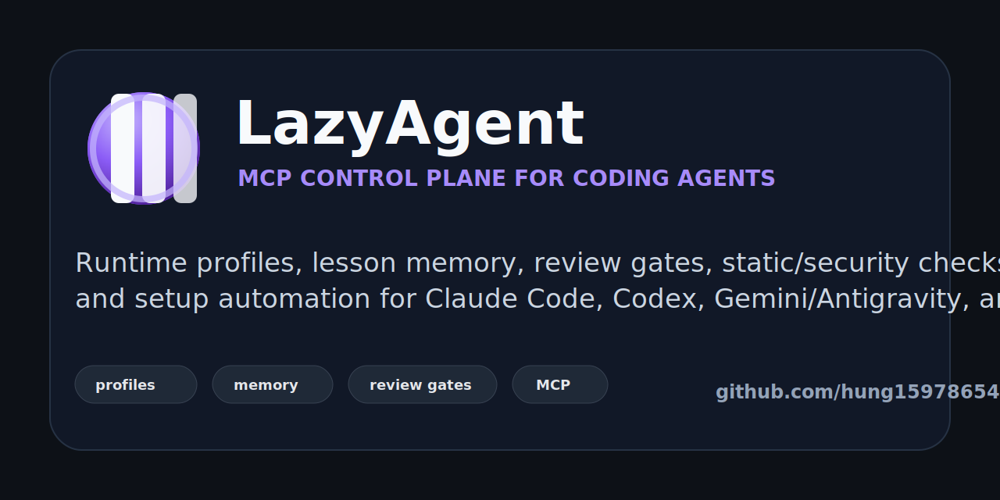

# LazyAgent



[](LICENSE)
[](https://github.com/hung1597865420/LazyAgent/releases)
[](https://modelcontextprotocol.io/)

LazyAgent is a Windows-first MCP control plane for coding agents. It gives Claude Code, Codex, Gemini/Antigravity, and other agent clients a shared layer for runtime profiles, review gates, lesson memory, static/security checks, workflow routing, and setup automation.

Use it when you want coding agents to behave less like isolated chat sessions and more like a governed engineering system: clear profiles, explicit model use, reusable memory, safety checks, and one command to enable or disable background automation.

> **Important:** chọn runtime profile trước khi chạy (`harness-toggle.bat` hoặc `harness-full-setup.bat --profile ...`). Repo mặc định nên để `off`; chỉ bật `heavy`/`max` khi thật sự muốn chạy automation tốn token/quota.

## Why LazyAgent

- **One control plane for many agents:** shared MCP tools and runtime policy for Claude, Codex, Gemini/Antigravity, and compatible clients.
- **Profiles before token burn:** `off`, `light`, `standard`, `balanced`, `review`, `heavy`, and `max` define what agents may do.
- **Review and safety gates:** multi-agent panel review, security/static scans, production readiness checks, and secret/config guards.
- **Memory that survives sessions:** local/global lessons, workflow notes, model/tool performance memory, and prompt-injection sanitization.
- **Windows setup included:** batch installers, toggle scripts, Auto-Watch integration, and user-level MCP/rules merge.

## Demo

- 60-second demo script: [docs/DEMO_SCRIPT.md](docs/DEMO_SCRIPT.md)
- Launch playbook and post copy: [docs/PUBLIC_LAUNCH.md](docs/PUBLIC_LAUNCH.md)
- GitHub release: [v0.1.0](https://github.com/hung1597865420/LazyAgent/releases/tag/v0.1.0)

## Quick Start

```powershell
git clone https://github.com/hung1597865420/LazyAgent.git
cd LazyAgent
python -m pip install -r requirements.txt
if (!(Test-Path .env.example)) { throw ".env.example is missing. Run this from the LazyAgent repo root or pull the latest commit." }
if (!(Test-Path .env)) { Copy-Item .env.example .env }
notepad .env
harness-full-setup.bat
harness-toggle.bat status
```

Fill `.env` with your OpenAI-compatible 9Router endpoint/key before using LLM-backed tools. If `.env` already existed, compare it with `.env.example` so new required variables are not missing.

## Project Status

- Runtime target: Windows-first, Python 3.10+, MCP clients for Claude/Codex/Gemini.
- LLM provider: OpenAI-compatible 9Router endpoint via `.env`.
- Public-safe defaults: no real credentials in repo, `.env` ignored, full setup defaults to profile `off`.
- Test coverage: `smoke_test.py` validates MCP registry, runtime profiles, routers, memory hardening, setup merge, Auto-Watch behavior and core tools.
- Community docs: `SECURITY.md`, `CONTRIBUTING.md`, `CODE_OF_CONDUCT.md`, and `CHANGELOG.md`.
- License: MIT.

## Publishing Checklist

- GitHub About description: `LazyAgent is an MCP control plane for coding agents: runtime profiles, memory, review gates, and automation for Claude Code, Codex, Gemini/Antigravity, and more.`
- Suggested topics: `mcp`, `ai-agents`, `coding-agents`, `claude-code`, `codex`, `gemini`, `llm`, `developer-tools`, `automation`, `code-review`, `windows`.
- License is MIT; keep the `LICENSE` file in sync if ownership changes.
- Create releases from `CHANGELOG.md` only after smoke tests pass and the staged diff is secret-clean.

## Security & Privacy

- Never commit `.env`, API keys, cookies, exported cost reports, local lesson DBs or runtime `.harness_*` files.
- Lesson/wiki context is injected as untrusted retrieval and scrubbed for prompt-control text such as `ignore previous instructions` and `read .env`.
- `harness.features.json` controls runtime behavior. Public/default installs should start from profile `off`; users opt in to higher profiles explicitly.
- If you publish this repo, rotate any credentials that were ever pasted into local shells, chat logs, screenshots or issue trackers.

---

## 1. Tổng Quan Kiến Trúc & Phân Vai Agent

LazyAgent/Agent Harness được xây dựng để làm "hội đồng cố vấn" hỗ trợ cho AI coder chính (**Claude Code**, **Gemini** trên Antigravity IDE). Runtime hiện đăng ký **90 MCP tools**: core LLM tools, goal autopilot, lesson memory, ECC-inspired ops doctors, Hallmark/Spec Kit/UI/workflow bridges, OfficeCLI bridge, scope-creep guard, một compatibility shim cho quota cũ, và static/static-first analyzers; Auto-Pilot có thể tự gọi scanner/reviewer phù hợp sau edit.

```
        Claude Code / Gemini (AI coder chính)
                          │
  ┌───────────────────────┴────────────────────────────┐
  ▼ (Tự động — Tier 1/2/3)                             ▼ (Gọi theo điều kiện)
MCP Server (agent-harness)                         MCP Server (agent-harness)
  │                                                    │
  ├─► panel_review     (Reviewer+Security+Tester)      ├─► consult          (Analyzer — Codex Review)
  ├─► secret_scanner   (entropy + regex + DOTALL)      ├─► alt_implementation(Code A/B song song)
  ├─► env_parity_checker(key diff .env vs .example)    ├─► suggest_fix      (Debugger — patch)
  ├─► complexity_analyzer(AST cyclomatic)              ├─► ask_codebase     (fast model chain + fallback)
  ├─► changelog_generator(conventional commits)        ├─► quick_task       (Worker)
  ├─► load_tester      (SSRF-safe, p50/p95/p99)        └─► dead_code_scanner, profiler, ...
  ├─► pr_generator, license_scanner, a11y_auditor, ...
  └─► incident_responder, coverage_analyzer, ...
  ▼
Web Dashboard (FastAPI + SSE) ──► http://localhost:8000
```

Các vai trò chi tiết của 12 Agent được mô tả trong bảng dưới đây:

| Tên Agent | Deployment Model | Vai trò kỹ thuật |
| :--- | :--- | :--- |
| **Manager** | `cx/gpt-5.4-mini` | Agent manager mặc định cho `ask_codebase` tiết kiệm; chain fallback sang 5.5 khi cần. |
| **Synthesizer** | `cx/gpt-5.4-mini` | Fast JSON synthesis/merge cho `panel_review` code findings, ưu tiên rẻ. |
| **Analyzer** | `cx/gpt-5.5-review` | Đề xuất giải pháp kiến trúc và phân tích trade-offs (concurrency, performance). |
| **Code A** | `cx/gpt-5.5` | Code agent thứ nhất, code-focused, dùng cho hướng chính. |
| **Code B** | `cx/gpt-5.5-review` | Code/review alternative để so sánh mà không dùng 5.6 primary. |
| **Reviewer** | `cx/gpt-5.5-review` | Phân tích chất lượng mã nguồn, phát hiện code smells, bugs và logic gaps. |
| **Tester** | `cx/gpt-5.5` | **Adversarial devil's advocate** — tìm race conditions, hidden assumptions và edge cases mà Reviewer + Security bỏ sót. Mỗi finding kèm input/scenario cụ thể làm code fail. |
| **Security** | `cx/gpt-5.5-review` | Dò quét lỗ hổng bảo mật (Injection, XSS, Secret exposure) có kèm attack vector. |
| **Integrity** | `cx/gpt-5.5-review` | **Stage 2 của panel** — chạy sau 3 reviewer: (1) tìm race condition/missing transaction/partial failure gap; (2) synthesize + dedupe toàn bộ findings. |
| **Scanner** | `cx/gpt-5.4-mini` | Static/code-assist scan cho metric/syntactic tools như `dead_code_scanner`, `performance_regression_detector`. |
| **Debugger** | `cx/gpt-5.5` | Tiếp nhận mã lỗi hoặc trace log, phân tích root cause và tạo file patch (`.diff`). |
| **Worker** | `cx/gpt-5.4-mini` | Tác vụ không phải code: tổng hợp tài liệu, PR/changelog draft, mock data, docstring, boilerplate nhẹ. |

Policy hiện tại: non-code/docs/static/manager/synthesizer/scanner dùng `cx/gpt-5.4-mini`; code/test/debug dùng `cx/gpt-5.5`; review/security/integrity/architecture dùng `cx/gpt-5.5-review`. 5.6 chỉ nằm trong `SPARE_MODELS` cuối danh sách để fallback khi user thật sự cần, không còn là primary.

---

## 2. Hướng Dẫn Cài Đặt Full Agent Harness

> **Triết lý: setup 1 lần, mọi project dùng được.**
> MCP server đăng ký `--scope user`; `merge_settings.py` ghi quy trình vào `~/.claude/CLAUDE.md` và hooks toàn cục; `WORKSPACE_ROOT=` nên để trống để harness tự bám theo project runtime của Claude/Codex/Gemini.

### 2.1. Cần cài gì trước

| Thứ cần có | Dùng cho tính năng nào | Cách kiểm tra |
|---|---|---|
| Python 3.10+ trên `PATH` | Chạy `mcp_server.py`, `tools/*`, smoke tests | `python --version` hoặc `py -3 --version` |
| Claude Code CLI `claude` | Đăng ký MCP server `agent-harness` | `claude --version` |
| 9Router Proxy/OpenAI key | 7 nhóm tool gọi LLM: `consult`, `panel_review`, `ask_codebase`, `suggest_fix`, `alt_implementation`, `quick_task`, `swarm_debug`, các enrichment LLM | `.env` có `ROUTER_BASE_URL` + `ROUTER_API_KEY` |
| 9Router local proxy | OpenAI-compatible Chat Completions for all configured models | `.env` có `ROUTER_BASE_URL=http://localhost:20128` |
| Playwright Chromium | `visual_reviewer` chụp screenshot UI | `python -m playwright install chromium` |
| Git | diff, blame, changelog, PR text, isolated worktree autofix | `git --version` |
| pytest + coverage | `auto_tester`, `coverage_analyzer`, isolated patch tests | Được cài qua `requirements.txt` |
| tree-sitter-languages | `index_codebase`, `semantic_search`, `dead_code_scanner` polyglot | Được cài qua `requirements.txt` |

Dependencies Python tối thiểu nằm trong `requirements.txt`: `openai`, `python-dotenv`, `pydantic`, `mcp`, `fastapi`, `uvicorn`, `playwright`, `pytest`, `coverage`, `httpx`, `tree-sitter-languages`.

### 2.1.1. Quick start cho máy/user mới

Checklist ngắn nhất để người khác clone/copy repo này rồi chạy được:

1. Cài Python 3.10+, Git, Claude Code CLI nếu dùng Claude, và 9Router local proxy/key.
2. Copy `.env.example` thành `.env`, điền `ROUTER_BASE_URL`, `ROUTER_API_KEY`, và giữ `WORKSPACE_ROOT=` trống để MCP tự bám theo project đang mở.
3. Chạy `python -m pip install -r requirements.txt`.
4. Muốn setup giống máy gốc về MCP/rules/hooks/memory cho mọi agent thì chạy `harness-full-setup.bat`; mặc định runtime vẫn là `off` để không tự chạy nền/tốn token.
5. Muốn setup chuẩn tiết kiệm hơn thì chạy `python merge_settings.py` để ghi MCP config + runtime rules cho Claude, Gemini/Antigravity, Codex và user-level agents.
6. Nếu dùng Claude Code mà không chạy full setup, chạy thêm `claude mcp add --scope user agent-harness -- python "<absolute-path>\\mcp_server.py"` hoặc dùng `install.ps1`.
7. Restart agent/IDE đang dùng, rồi kiểm tra bằng `harness-toggle.bat status`, `list_agents`, và một static tool như `secret_scanner`.

Không commit `.env`, `harness.features.json` cá nhân, `.harness_finops.db`, `.harness_lessons.jsonl`, hoặc các file runtime `.harness_*`. Nếu muốn chuyển máy kèm knowledge, copy `llmwiki/` của project và optional global wiki `~/.claude/llmwiki/`, nhưng vẫn để secret nằm riêng trên từng máy.

### 2.2. Chuẩn bị `.env`

Tạo `.env` từ `.env.example` rồi điền credentials thật. Không commit `.env`.
Mặc định harness đọc `.env` cạnh `mcp_server.py`; nếu cần env file khác, set `HARNESS_ENV_FILE=<path-to-harness>\.env`, hoặc set `HARNESS_DISABLE_DOTENV=1` để chỉ dùng biến môi trường đã inject.

```env
# Chat Completions / model inference endpoint
ROUTER_BASE_URL=http://localhost:0931289317
ROUTER_API_KEY=dummy
# Một số 9Router pool chặn User-Agent mặc định của OpenAI Python SDK.
ROUTER_USER_AGENT=python-httpx/0.28.1

# 12-agent role mapping. Đổi nếu deployment name trên 9Router khác mặc định.
MODEL_MANAGER=cx/gpt-5.4-mini
MODEL_SYNTHESIZER=cx/gpt-5.4-mini
MODEL_ANALYZER=cx/gpt-5.5-review
MODEL_CODE_A=cx/gpt-5.5
MODEL_CODE_B=cx/gpt-5.5-review
MODEL_REVIEWER=cx/gpt-5.5-review
MODEL_TESTER=cx/gpt-5.5
MODEL_SECURITY=cx/gpt-5.5-review
MODEL_INTEGRITY=cx/gpt-5.5-review
MODEL_SCANNER=cx/gpt-5.4-mini
MODEL_DEBUGGER=cx/gpt-5.5
MODEL_WORKER=cx/gpt-5.4-mini

# Fallback khi primary model bị timeout/rate-limit.
SPARE_MODELS=cx/gpt-5.4-mini,cx/gpt-5.5,cx/gpt-5.5-review,cx/gpt-5.6-sol,cx/gpt-5.6-sol-review
HARNESS_KNOWN_DEPLOYMENTS=cx/gpt-5.6-sol,cx/gpt-5.6-sol-review,cx/gpt-5.6-terra,cx/gpt-5.6-terra-review,cx/gpt-5.6-luna,cx/gpt-5.6-luna-review,cx/gpt-5.5,cx/gpt-5.5-review,cx/gpt-5.4,cx/gpt-5.4-review,cx/gpt-5.4-mini

# ask_codebase fast path.
HARNESS_ASK_CODEBASE_MODEL_CHAIN=cx/gpt-5.4-mini,cx/gpt-5.5,cx/gpt-5.5-review
HARNESS_ASK_CODEBASE_CONTEXT_BYTES=220000
HARNESS_ASK_CODEBASE_MAX_OUTPUT_TOKENS=8192

# Để trống để MCP scope user tự dùng project đang mở.
WORKSPACE_ROOT=

# Auto features.
HARNESS_FEATURES_FILE=
HARNESS_AUTO_PILOT=1
HARNESS_AUTO_MODE=safe
HARNESS_STATIC_LLM=0
HARNESS_AUTO_LLM=0
HARNESS_AUTO_WATCH=0
HARNESS_AUTO_WATCH_MODE=safe
HARNESS_AUTO_WATCH_LLM=0
HARNESS_AUTO_WATCH_INTERVAL=3
HARNESS_AUTO_WATCH_DEBOUNCE=2

# Hard kill-switch for all LLM calls.
HARNESS_LLM_ENABLED=1
```

### 2.2.1. Kết nối 9Router OpenAI Codex provider

Với 9Router/API pool dùng Codex provider, harness gọi theo chuẩn OpenAI-compatible Chat Completions:

- Base URL phải trỏ tới endpoint `/v1`, ví dụ `https://apipool.example.com/v1`.
- API key đi vào `ROUTER_API_KEY`; không commit `.env`, không paste key vào log public.
- Model Codex trên 9Router thường có prefix `cx/...`; defaults economy hiện tại dùng `cx/gpt-5.4-mini`, `cx/gpt-5.5`, và `cx/gpt-5.5-review`. 5.6 chỉ để fallback cuối vì giá cao.
- `ROUTER_USER_AGENT=python-httpx/0.28.1` là quan trọng với một số 9Router pool. Dashboard có thể báo provider connection `success`, nhưng OpenAI Python SDK vẫn bị API/WAF chặn nếu dùng User-Agent mặc định, lỗi thường thấy là `PermissionDeniedError: Your request was blocked.`

Checklist kiểm nhanh sau khi điền `.env`:

```powershell
python -c "from config import get_llm_client; c=get_llm_client(); ids=[m.id for m in c.models.list().data]; print(len(ids)); print(all(x in ids for x in ['cx/gpt-5.4-mini','cx/gpt-5.5','cx/gpt-5.5-review']))"
```

Test inference thật, prompt rất nhỏ:

```powershell
$env:PYTHONIOENCODING='utf-8'
@'
from config import get_llm_client, MODELS

client = get_llm_client()
for role, model in [
    ("worker", MODELS.worker),
    ("code", MODELS.code_a),
    ("alt", MODELS.code_b),
    ("review", MODELS.reviewer),
]:
    r = client.chat.completions.create(
        model=model,
        messages=[{"role": "user", "content": "Tra loi dung mot cau: Harness Codex chay duoc."}],
        max_completion_tokens=32,
        timeout=45,
    )
    text = (r.choices[0].message.content or "").strip().replace("\n", " ")
    usage = getattr(r, "usage", None)
    print(role, model, text, getattr(usage, "prompt_tokens", None), getattr(usage, "completion_tokens", None))
'@ | python -
```

Kết quả tốt là mỗi role trả một câu ngắn như `Harness Codex chay duoc.`. Nếu dashboard provider pass nhưng script fail `PermissionDeniedError`, kiểm lại `ROUTER_USER_AGENT`, base URL đúng `/v1`, key đúng pool, và provider/model `cx/...` đang bật trong 9Router. Nếu chỉ lỗi Unicode khi in tiếng Việt trên Windows, set `PYTHONIOENCODING=utf-8` hoặc dùng prompt không dấu như ví dụ trên.

Mặc định mới là tiết kiệm tiền: file `harness.features.json` giữ Auto-Pilot ở `safe`, tắt Auto-Watch, tắt 9Router LLM enrichment cho auto-run/static tools. Env `HARNESS_AUTO_*` vẫn là fallback; nếu file control tồn tại thì file thắng env. Muốn dùng profile khác tạm thời thì set `HARNESS_FEATURES_FILE=C:\path\to\features.json`.

Ví dụ file nhẹ để máy không ì:

```json
{
  "llm": {"enabled": true, "static": false},
  "finops": {"enabled": true},
  "hooks": {"enabled": true},
  "lessons": {"enabled": true},
  "auto_pilot": {"enabled": true, "mode": "safe", "llm": false},
  "auto_watch": {"enabled": false, "mode": "safe", "llm": false, "interval": 3, "debounce": 2},
  "static_llm": false
}
```

Trên Windows có thể đổi nhanh bằng batch:

```bat
harness-toggle.bat
harness-toggle.bat status
harness-toggle.bat list
set HARNESS_ALLOW_PROFILE_WRITE=1
harness-toggle.bat off
harness-toggle.bat light
harness-toggle.bat standard
harness-toggle.bat 4
harness-toggle.bat 5
harness-toggle.bat 7
harness-toggle.bat balanced
harness-toggle.bat review
harness-toggle.bat heavy
harness-toggle.bat max
harness-toggle.bat set auto-watch off
harness-toggle.bat toggle lessons
harness-toggle.bat set finops off
set HARNESS_ALLOW_PROFILE_WRITE=
```

Muốn cài full cho máy/user khác giống setup hiện tại thì dùng:

```bat
harness-full-setup.bat
harness-full-setup.bat --profile max
harness-full-setup.bat --profile heavy
harness-full-setup.bat --no-watch --no-smoke
harness-full-setup.bat --start-dashboard
```

`harness-full-setup.bat` tự cài Python deps, Playwright, sync `merge_settings.py` cho Claude/Gemini/Codex, đăng ký Claude MCP nếu có CLI `claude`, install git pre-commit hook nếu repo có `.git`, copy `llmwiki/` sang `~/.claude/llmwiki`, và cài Windows Scheduled Task `AgentHarnessAutoWatch` để gọi `auto_watch.py` lúc user đăng nhập. Mặc định script ghi profile `off`: cài đủ năng lực nhưng không bật LLM, FinOps writes, lesson capture, hooks runtime, Auto-Pilot hay Auto-Watch. Scheduled Task vẫn an toàn vì `auto_watch.py` đọc profile `off` rồi thoát ngay; muốn bật full thật thì chạy rõ `harness-full-setup.bat --profile max`; khi đó batch bật toàn bộ feature flag trong `harness.features.json` và start Auto-Watch. Nếu thiếu `.env`, script copy `.env.example` thành `.env`, skip smoke test và nhắc user điền 9Router credentials.

Double-click `harness-toggle.bat` sẽ mở menu tương tác và không tự đóng ngay. Batch toggle được từng feature riêng: `llm`, `finops`, `hooks`, `lessons`, `auto-pilot`, `auto-pilot-llm`, `auto-watch`, `auto-watch-llm`, `static-llm`, `wiki`, `code-index`, `dashboard`. Các flag đã được code đọc trực tiếp gồm LLM hard kill-switch, FinOps logging, hook bridge, lesson memory, Auto-Pilot, Auto-Watch, và static LLM enrichment. `hooks=off` vẫn cho phép hook prompt inject một snapshot profile read-only ở client hỗ trợ hooks; Gemini/Antigravity không có hook prompt tương đương trong config hiện tại nên `GEMINI.md` bắt buộc refresh profile bằng cách đọc `harness.features.json` ở đầu mỗi prompt/session. `wiki`, `code-index`, `dashboard` là on-demand/manual preference; batch có action riêng cho dashboard/watch/hook install. Để tránh agent tự đổi runtime profile, mọi lệnh CLI có ghi `harness.features.json` phải set `HARNESS_ALLOW_PROFILE_WRITE=1`; menu tương tác được xem là user-approved.

Maintenance rule: khi thêm/xóa runtime feature hoặc đổi ý nghĩa profile, update cả `harness-toggle.bat`, `harness-full-setup.bat`, `merge_settings.py` profile policy và README trong cùng batch.

Thang profile theo mức sử dụng token: `off` = 0/10 hard-off, `light` = 1/10 dùng hằng ngày, `standard` = 2/10 bật watcher safe nhưng không auto LLM, `balanced`/`4` = 4/10 cho Auto-Pilot dùng LLM nhưng watcher tắt, `review`/`5` = 5/10 thêm static LLM và watcher safe không LLM, `heavy`/`7` = 7/10 bật Auto-Pilot max + watcher LLM safe, `max` = 8-9/10 aggressive checks + watcher fast + LLM enrichment.

Profile `standard` vẫn bật `llm=true`, nghĩa là bạn gọi tool LLM thủ công vẫn được; nó chỉ tắt `auto-pilot-llm`, `auto-watch-llm`, và `static-llm` để tránh tự động gọi LLM nền. Profile `off` thì tắt cả `llm=false`, đúng nghĩa không gọi model.

Agent policy theo profile được inject cho mọi client chính qua `merge_settings.py`: Claude đọc `~/.claude/CLAUDE.md`, Gemini/Antigravity đọc `~/.gemini/GEMINI.md`, Codex đọc `~/.codex/AGENTS.md`, và agent generic/user-level đọc `~/AGENTS.md`. Policy này đứng trên các rule tự động khác: profile thấp không được tự nâng profile, không được bypass `llm.enabled=false`, và nếu profile không cho phép LLM thì agent phải dùng static/local fallback rồi báo ngắn `profile <name> đang chặn LLM`.

### 2.2.1. Distilled routers đã chưng cất vào Auto-Pilot

Harness không vendor nguyên repo Hallmark, Spec Kit, `ibelick/ui-skills`, `mattpocock/skills` hay `kangarooking/cangjie-skill` vào core. Thay vào đó các repo này được chưng cất thành route/check tĩnh: `integration_router`, `ui_skill_router`, `workflow_router`, `bug_repro_guard`, cùng bridge thật `hallmark_bridge`/`speckit_bridge`. `auto_trigger` tự trả `integration_routes` + `workflow_routes`, và `goal_runner` tự bơm guidance vào prompt agent ngoài.

- **Hallmark bridge:** `hallmark_bridge(action="preflight")` đọc framework/tokens/fonts/motion/ui scope theo kiểu Hallmark trước khi code UI; `audit_plan` trả checklist; `write_preflight` ghi `.hallmark/preflight.json` khi `allow_mutation=true` và profile cho phép. `a11y_auditor` vẫn chỉ là post-code audit WCAG/design-state, không phải tool thiết kế.
- **UI Skills router:** `ui_skill_router` lấy taxonomy của `ibelick/ui-skills`, chọn tối đa 3 checklist nhỏ (`baseline-ui`, `fixing-accessibility`, `fixing-motion-performance`, `fixing-metadata`, `improve-ui`) để tránh UI task nào cũng kéo review nặng. Auto-Pilot vẫn dùng `a11y_auditor`/`visual_reviewer` sau code khi phù hợp.
- **Spec Kit bridge:** `speckit_bridge(action="status"|"snapshot")` đọc CLI/artifacts/specs hiện có; `init` gọi `specify init --here --integration <agent>` nếu CLI có sẵn; `scaffold` tạo `specs/<feature>/spec.md`, `plan.md`, `tasks.md` fallback khi profile/allow_mutation cho phép.
- **Workflow router:** `workflow_router` lấy phần Matt workflow: debug/spec/tickets/wayfinder/domain-context/code-review-axes/TDD seam/architecture deepening. `bug_repro_guard` là P0 static check: debug task phải có repro command/output trước khi fix kiểu đoán mò.
- **Lesson quality gate:** `lesson_curator` và mọi đường ghi global procedure dùng Cangjie-style static RIA-TV gate: title/summary, actionable steps, trigger, boundary, should-trigger/should-not-trigger/edge-case prompts, và reject common-sense/secret/local/debug-only memory trước khi promote global.
- **Profile gate:** profile `off` chỉ cho bridge/router chạy read-only/status/preflight/snapshot/static report; không tự gọi Hallmark/Spec Kit/Workflow LLM workflow, không tự init/scaffold Spec Kit, không gọi `goal_runner`.

### 2.2.2. awesome-llm-apps / OfficeCLI / DesktopCommander đã chưng cất thế nào

Harness không vendor nguyên ba repo này. Chỉ lấy phần có ROI cao và đủ an toàn cho automation:

- **Scope guard từ awesome-llm-apps:** `scope_creep_detector` là tool static/local, đọc unified diff hoặc tự chạy `git diff --no-ext-diff --no-textconv`, rồi so với task để flag dependency mới, CI/build/config edit, public API rename, hunk quá lớn hoặc file lệch intent. Auto-Pilot có thể gọi guard này như một check nhẹ; profile `off` vẫn gọi thủ công được vì không dùng LLM.
- **OfficeCLI bridge:** `office_bridge(action="status"|"help"|"view"|"validate"|"get"|"query"|"dump")` chỉ chạy nếu máy đã có `officecli` trong PATH. Harness không tự install OfficeCLI. Read actions chạy với `OFFICECLI_NO_AUTO_RESIDENT=1` để tránh resident chạy nền.
- **Office mutation gate:** `create`, `set`, `add`, `remove`, `batch`, `raw_set`, `open`, `save`, `close`, `watch`, `unwatch`, `goto` cần `allow_mutation=true` và profile cao hơn `off`. `watch`/resident không được tự bật khi profile tắt.
- **DesktopCommanderMCP:** không embed, không auto-start, không setup cho all-agent. Repo đó có tool shell/file rất mạnh nhưng security model của chính nó nói `allowedDirectories` chỉ là guardrail, không phải sandbox; harness chỉ học ý tưởng audit log, process pagination và cảnh báo sandbox.

| Profile | Agent được làm | Agent không được làm |
|---|---|---|
| `off` | Chỉ read-only/static local: status/list/json, đọc file, git status/diff, py_compile/lint/test khi user yêu cầu. | Không gọi LLM tools (`consult`, `panel_review`, `ask_codebase`, `alt_implementation`, `suggest_fix`, `quick_task`, `swarm_debug`), không `goal_runner`, không `prod_readiness_gate max`, không bật hooks/lessons/finops/watch. |
| `light` | Static-first checks, hooks/lessons/finops nếu enabled, `auto_trigger safe` không LLM. | Không auto LLM enrichment, không watcher, không tự đổi profile. |
| `standard` | Như `light` + watcher safe static. | Watcher/Auto-Pilot không gọi LLM, không `static_llm`, không max fan-out. |
| `balanced` / `4` | Coding/review chủ động: `consult`, `panel_review`, `ask_codebase`, `auto_trigger safe` khi rule thật sự khớp. | Không watcher, không static LLM nền, không max/prod fan-out mặc định. |
| `review` / `5` | Auto-Pilot LLM + static LLM cho batch review; watcher safe không LLM. | Watcher không gọi LLM, không max fan-out mặc định. |
| `heavy` / `7` | Refactor/debug khó: Auto-Pilot max, static LLM, watcher LLM safe. | Không chạy release/prod gates liên tục, không panel lặp từng file. |
| `max` | Full audit/release khi user chọn rõ: aggressive checks, watcher fast, LLM enrichment, prod/release gates. | Không tự chuyển từ profile thấp lên `max`, không để mặc định cả ngày. |

### 2.3. Cài tự động trên Windows

Mở PowerShell ngay trong folder harness rồi chạy:

```powershell
powershell -ExecutionPolicy Bypass -File install.ps1
```

Script làm đúng các bước chính:
1. Check `python`/`py`, check `claude`, check `.env`.
2. Chạy `python -m pip install -r requirements.txt` và `python -m playwright install chromium`.
3. Chạy `claude mcp remove --scope user agent-harness` rồi `claude mcp add --scope user agent-harness -- <python> <folder>\mcp_server.py` để idempotent.
4. Chạy `python merge_settings.py` để ghi rules/profile policy vào `~/.claude/CLAUDE.md`, `~/.gemini/GEMINI.md`, `~/.codex/AGENTS.md`, `~/AGENTS.md`, đồng thời ghi MCP config cho Claude/Gemini/Codex.
5. Chạy `python smoke_test.py` nếu runtime profile không phải `off`.

Sau đó restart Claude Code và gõ:

```text
/mcp
```

Kỳ vọng thấy `agent-harness` connected. Nếu client là Codex hoặc một MCP client có lazy/deferred tools, tool có thể chưa hiện hết ngay; dùng discovery/search theo tên tool hoặc capability, ví dụ `a11y_auditor`, rồi namespace `mcp__agent_harness__...` mới được expose.

### 2.3.1. Cài full cho mọi agent bằng batch

Dùng cho máy/user mới muốn setup giống máy gốc nhất có thể nhưng vẫn an toàn mặc định:

```bat
harness-full-setup.bat
```

Batch này làm idempotent các việc sau:

1. Kiểm tra/copy `.env`; nếu chỉ mới copy từ `.env.example` thì skip smoke để user điền 9Router key trước.
2. Cài `requirements.txt` và Playwright Chromium.
3. Chạy `merge_settings.py` để sync MCP config + rules + memory hooks cho Claude, Gemini/Antigravity, Codex và `~/AGENTS.md`.
4. Đăng ký Claude MCP qua CLI `claude` nếu máy có Claude Code.
5. Set runtime profile mặc định `off`, tức cài đủ nhưng không tự chạy nền, không gọi LLM và không ghi FinOps/lesson cho tới khi user bật profile cao hơn.
6. Cài git pre-commit hook cho repo harness nếu đang là git repo.
7. Copy `llmwiki/` sang `~/.claude/llmwiki` để có global wiki seed.
8. Cài Windows Scheduled Task `AgentHarnessAutoWatch` để Auto-Watch có thể chạy cùng Windows. Với profile mặc định `off`, task start rồi thoát ngay vì `auto_watch.enabled=false`; khi user bật profile có Auto-Watch, lần đăng nhập sau watcher sẽ tự lên.
9. Chạy `smoke_test.py` nếu profile không phải `off`, `.env` đã có sẵn và không truyền `--no-smoke`.

Các option hay dùng:

```bat
harness-full-setup.bat --profile max
harness-full-setup.bat --profile heavy
harness-full-setup.bat --no-watch --no-smoke
harness-full-setup.bat --no-startup-task
harness-full-setup.bat --start-dashboard
harness-full-setup.bat --help
```

`--profile max` mới là chế độ bật full thật: `llm`, `finops`, `hooks`, `lessons`, `auto-pilot`, `auto-pilot-llm`, `auto-watch`, `auto-watch-llm`, `static-llm`, `wiki`, `code-index`, `dashboard`, mode/timing aggressive.

### 2.4. Cài thủ công trên macOS/Linux/WSL

```bash
python -m pip install -r requirements.txt
python -m playwright install chromium
claude mcp remove --scope user agent-harness || true
claude mcp add --scope user agent-harness -- python "/absolute/path/to/mcp_server.py"
python merge_settings.py
# Chỉ chạy full smoke khi profile không phải off.
python smoke_test.py
```

Nếu dùng `uv`, `conda`, hoặc venv riêng, thay `python` trong lệnh `claude mcp add` bằng đường dẫn Python thật của environment đó. MCP server sẽ chạy bằng đúng interpreter được đăng ký.

### 2.5. Enable đủ tính năng

| Tính năng | Bật bằng gì | Verify nhanh |
|---|---|---|
| MCP tool registry | `claude mcp add --scope user agent-harness -- python mcp_server.py` | `/mcp`, hoặc gọi `list_agents` |
| Global workflow rules | `python merge_settings.py` | Kiểm tra `~/.claude/CLAUDE.md` có block `agent-harness` |
| Hook nhắc review | `python merge_settings.py` | Sửa code xong Claude được nhắc gọi `panel_review` |
| Goal Autopilot | `python merge_settings.py` + MCP connected | Prompt một lần; `goal_autopilot(init)` chia parts, `auto_trigger(mode=safe)` check static-first từng part, `goal_supervisor` trả next action cứng |
| Direct goal runner | `python goal_runner.py "<prompt>"` hoặc MCP `goal_runner` | Harness nhận prompt trực tiếp, tự init goal, gọi agent CLI, check/supervise/final |
| Runtime feature file | `harness.features.json`; project file thắng, nếu không có thì dùng file trong harness install | Bật/tắt nhanh `auto_pilot`, `auto_watch`, `static_llm` mà không đụng secret/env |
| Install manifest doctor | `harness.install.json` + MCP `install_manifest` | Dry-run setup profiles/targets, biết target nào cần file gì trước khi cài hoặc debug máy user khác |
| Auto-Pilot | `harness.features.json`: `auto_pilot.enabled=true`, `mode=safe` | Gọi `auto_trigger(changed_files=[...], stage="post_edit")`; muốn auto gọi 9Router phải bật thêm `auto_pilot.llm=true` |
| Production readiness gate | MCP connected; dùng `mode=max` trước deploy thật | Gọi `prod_readiness_gate(changed_files=[...], task="release/prod check", mode="max")`; chỉ deploy/claim prod-ready khi verdict cho phép |
| Auto-Watch daemon | Mặc định tắt để chống phát sinh 9Router ẩn; bật bằng `harness.features.json`: `auto_watch.enabled=true`. Khi bật, watcher mặc định chạy `mode=safe` và `llm=false` | Xem `.harness_auto_watch.log`; watcher bỏ qua `.harness_*`, `.claude/audit`, `REVIEW_REPORT.md`, `llmwiki/raw/.bootstrapped`; sửa file tắt thì watcher tự thoát ở vòng lặp kế |
| Local/global llmwiki | Local wiki tự bootstrap `llmwiki/raw` + `wiki/*` lần đầu; copy seed vào `~/.claude/llmwiki` nếu muốn share global knowledge | `wiki_query("jwt")`, `wiki_lint` |
| Lesson Memory local/global | Tự bật qua MCP hooks + `auto_trigger` + `goal_runner`; local ghi trong project, global ghi vào `~/.claude` khi lesson reusable qua curator | Xem `.harness_lessons.jsonl`, `~/.claude/.harness_global_lessons.jsonl`, hoặc gọi `run_ledger` |
| Code index polyglot | `tree-sitter-languages` + `index_codebase` | `semantic_search("panel_review")` |
| Visual review | Playwright Chromium | `visual_reviewer(url="http://localhost:3000")` |
| Test/coverage | pytest + coverage | `coverage_analyzer` |
| Security/config scan | `.env.example` đầy đủ, repo không commit secrets | `secret_scanner`, `env_parity_checker`, `config_security_audit` |
| FinOps | SQLite file `.harness_finops.db` tự tạo | `finops_stats`; thống kê token/cost local, không chặn request. Quota thật xem trong 9Router dashboard/API pool. |
| Web dashboard tùy chọn | `python server.py` | Mở `http://localhost:8000` |

### 2.6. Danh mục đủ 90 MCP tools và cần chuẩn bị gì

| Nhóm | Tools | Phụ thuộc chính | Khi dùng |
|---|---|---|---|
| Orchestration | `goal_autopilot`, `goal_supervisor`, `goal_runner`, `auto_trigger`, `prod_readiness_gate`, `release_orchestrator`, `run_single_agent`, `list_agents` | MCP connected, `.env` nếu gọi agent LLM, optional agent CLI | Prompt-only goal flow, direct prompt runner, hard next-action loop, Auto-Pilot, production/release gate, gọi thẳng agent, xem model mapping |
| Harness ops | `harness_doctor`, `install_manifest`, `adapter_parity_doctor`, `mcp_inventory`, `context_budget`, `context_auditor`, `ask_codebase_health`, `goal_runner_control`, `run_ledger`, `policy_profile`, `agent_adapters`, `benchmark_runner`, `patch_safety_check`, `integration_router`, `workflow_router`, `bug_repro_guard`, `ui_skill_router`, `hallmark_bridge`, `speckit_bridge`, `scope_creep_detector`, `office_bridge` | Git, optional agent CLI, optional `specify` CLI, optional `officecli` | Self-check, dry-run install manifest, cross-agent parity, MCP config inventory, context/token overhead audit, ask_codebase preflight, runner resume/status, audit ledger, profiles, adapters, benchmark dry-run, isolated patch check, Hallmark preflight, UI/workflow routing, debug repro guard, Spec Kit status/init/scaffold, scope drift, Office doc inspect/validate |
| Deep reasoning/review | `consult`, `alt_implementation`, `panel_review`, `suggest_fix`, `quick_task`, `ask_codebase`, `swarm_debug` | 9Router models, `SPARE_MODELS`, workspace files | Design, alternative implementation, review cuối, debug bí, việc vặt, hỏi codebase |
| Security fix loop | `security_autofix`, `auto_tester`, `run_in_sandbox` | Git worktree, pytest, 9Router debugger/tester | Auto-fix Critical/High security finding, sinh test, chạy reproducer cô lập |
| Wiki/memory | `wiki_ingest`, `wiki_query`, `wiki_lint`, `doc_sync`, `lesson_curator` | `llmwiki/raw`, `llmwiki/wiki`, `.harness_lessons.jsonl`, `~/.claude/.harness_global_lessons.jsonl`, README | Ingest/query wiki, ghi lesson local/global, lọc lesson trước khi promote global, đồng bộ docs |
| Static/code index | `index_codebase`, `semantic_search`, `dead_code_scanner`, `dependency_graph_visualizer` | tree-sitter-languages, SQLite cache | Search polyglot, dead code, import graph/cycle |
| Security/config | `secret_scanner`, `config_security_audit`, `env_parity_checker`, `data_flow_taint_analyzer`, `auth_matrix_auditor` | `.env.example`, source files, API route files | Secrets, CORS/env drift, taint user input, auth/ownership matrix |
| Quality gates | `devops_pipeline`, `complexity_analyzer`, `duplicate_code_scanner`, `polyglot_reviewer`, `incremental_refactor_guard` | ruff/flake8/mypy/black optional fallback, AST/LLM, git diff | Pre-PR quality, complexity, copy-paste, language-specific review, refactor breakage guard |
| API/data contracts | `api_contract_tester`, `openapi_spec_sync`, `schema_drift`, `breaking_change_detector`, `migration_validator`, `sql_query_analyzer` | pytest, OpenAPI/Pydantic/ORM/migrations if present | Endpoint contract, schema drift, breaking changes, DB migration/query risk |
| Testing/resilience/perf | `coverage_analyzer`, `flaky_test_detector`, `mutation_tester`, `load_tester`, `chaos_tester`, `benchmarker`, `profiler`, `performance_regression_detector` | pytest, coverage, httpx, cProfile/tracemalloc, Git diff | Test coverage, flaky/mutation, load/chaos, benchmark/profile/regression |
| UI/product docs | `visual_reviewer`, `a11y_auditor`, `i18n_auditor`, `pr_generator`, `changelog_generator` | Playwright for screenshots, HTML/CSS/JSX files, Git log/diff | UI screenshot audit + Executive Command criteria, WCAG, hardcoded strings, PR/changelog |
| Supply chain/release | `dependency_upgrader`, `license_scanner`, `sbom_generator`, `container_linter`, `ci_pipeline_validator`, `feature_flag_auditor`, `provenance_checker` | requirements/package files, Docker/CI files, Git | Upgrade dry-run, license/SBOM, Docker/CI lint, stale flags, provenance evidence |
| Incident/intel | `incident_responder`, `telemetry_debugger`, `git_archaeologist`, `finops_stats`, `harness_trace_viewer` | Logs/stack traces, Git blame, `.harness_finops.db` | Incident triage, stack trace patch hint, why code changed, cost/token stats, harness trace/bottleneck view |

### 2.7. Cách “cày” kiểm tra sau khi cài

Chạy theo thứ tự này để biết full harness đã hoạt động:

1. **Profile status:** `harness-toggle.bat status`. Nếu đang `off`, chỉ làm các bước read-only/static; full smoke sẽ fail hoặc bị chặn đúng policy vì `off` tắt Auto-Pilot/lessons/LLM.
2. **Smoke offline:** `python smoke_test.py` khi profile là `light` trở lên; không dùng lệnh này để ép profile `off` chạy full automation.
3. **MCP handshake:** restart client, `/mcp`, thấy `agent-harness connected`.
4. **Registry:** gọi `list_agents`; phải thấy 12 role và model deployment.
5. **Static tools không tốn token:** gọi `index_codebase(force=true)`, `semantic_search("mcp server")`, `secret_scanner(paths=[".env.example"])`.
6. **9Router LLM path:** gọi `quick_task(instruction="Trả lời một câu ngắn: harness OK")`.
7. **Review path:** tạo diff nhỏ rồi gọi `panel_review(files=["file_vua_sua.py"])`.
8. **Visual path:** chạy app local rồi gọi `visual_reviewer(url="http://localhost:<port>")`.
9. **Wiki path:** gọi `wiki_query("keyword")`; project mới sẽ tự tạo `llmwiki/` và auto-ingest docs sẵn có.
10. **Auto path:** gọi `auto_trigger(changed_files=["src/app.py"], task="verify install", stage="post_edit", mode="safe")`.
11. **Prod gate path:** gọi `prod_readiness_gate(changed_files=["README.md"], task="ready for production deploy?", mode="safe")`; trước deploy thật dùng `mode="max"`.
12. **Goal path:** gọi `goal_autopilot(mode="status")`, rồi chạy E2E init/check/complete trên workspace tạm nếu muốn test đủ final check.
13. **Direct runner path:** chạy `python goal_runner.py "update README smoke" --dry-run --mode safe`; chạy thật thì bỏ `--dry-run` và bảo đảm có `HARNESS_GOAL_AGENT_CMD` hoặc CLI `claude`/`gemini`/`codex`.
14. **FinOps:** gọi `finops_stats` để chắc LLM calls được log.

#### Goal Autopilot verification

Đã verify lại ngày 2026-07-13:

```text
python -m py_compile test_goal.py tools/goal.py tools/auto.py tools/prod.py mcp_server.py support_tools.py merge_settings.py smoke_test.py llmwiki_tool.py
python test_goal.py
python smoke_test.py
```

Kết quả: tất cả pass. `smoke_test.py` xác nhận MCP registry có 90 tools, `goal_autopilot status`, `goal_supervisor`, `goal_runner` dry-run, ops tools, distilled integration/workflow/UI bridges, OfficeCLI/scope guard bridges, quota compatibility shim, 5 gap tools mới, và các nhánh `prod_readiness_gate`:

- docs-only safe path trả verdict hợp lệ, không cần 9Router.
- invalid `mode` trả error.
- `since_commit` non-string không crash.
- finding `triage="ask_user"` chặn bằng `blocked_needs_user`.
- verdict con `fix_required` được tính là blocker.

Docs-only safe chỉ là smoke nhẹ, không đủ để claim production-ready; release thật phải chạy `prod_readiness_gate(..., mode="max")`.

E2E MCP thật đã chạy trên workspace tạm:

```text
goal_autopilot(init)      -> initialized, split thành 2 parts
goal_autopilot(check)     -> checked
goal_supervisor           -> next_action run_final/complete/block...
goal_autopilot(complete)  -> completed
final auto_trigger        -> completed, blockers_count=0
selected_tools            -> goal_alignment, secret_scanner, env_parity_checker,
                             config_security_audit, complexity_analyzer,
                             devops_pipeline, panel_review
```

Blocker guard cũng đã verify: khi final `auto_trigger` trả `blockers_count=1`, `goal_autopilot(complete)` không đóng goal là `completed` mà chuyển sang `blocked` để agent tiếp tục sửa.

Cross-agent đã verify:

```text
list_agents               -> 12 roles/models
Claude rules              -> ~/.claude/CLAUDE.md có goal_autopilot + goal_supervisor
Gemini rules              -> ~/.gemini/GEMINI.md có goal_autopilot + goal_supervisor
Claude MCP config         -> trỏ tới mcp_server.py hiện tại
Gemini/Antigravity config -> trỏ tới mcp_server.py hiện tại
Codex MCP config          -> có mcp_servers.agent-harness
```

<!-- harness-current-operations -->
### 2.8. Trạng thái vận hành hiện tại

Các capability chính hiện có:

- **Prompt-only goal loop:** `goal_autopilot(init)` tạo goal, chia parts và lưu `.harness_goal_state.json`.
- **Direct prompt runner:** `goal_runner` / `python goal_runner.py "<prompt>"` nhận prompt trực tiếp, tự init goal, gọi agent CLI, chạy `auto_trigger`, hỏi `goal_supervisor`, rồi final bằng `prod_readiness_gate`.
- **Harness ops layer:** `harness_doctor`, `install_manifest`, `adapter_parity_doctor`, `mcp_inventory`, `context_budget`, `context_auditor`, `ask_codebase_health`, `goal_runner_control`, `run_ledger`, `policy_profile`, `agent_adapters`, `benchmark_runner`, `patch_safety_check` cover readiness, dry-run install planning, cross-agent parity, MCP config drift, context/token overhead, resume/status, audit trail, profiles, adapters, benchmark, and isolated patch safety. `goal_runner` tự ghi doctor event + ledger; `ask_codebase` tự đính `context_health` vào response sau khi narrow/prune/redact.
- **Hard supervisor:** `goal_supervisor` đọc goal state + last checks và trả đúng một `next_action`: `continue_part`, `run_check`, `run_final`, `blocked_ask_user`, hoặc `complete`.
- **Goal summary injector:** context của `consult`, `panel_review`, `ask_codebase`, `auto_trigger`/goal checks tự có dòng ngắn: `Goal: X | Part N/M | Last verdict: ... | Blockers: ... | Next: ...`.
- **Production readiness gate:** `prod_readiness_gate` gom final `auto_trigger`, security/env/secret, review và release checks; trả verdict cứng `ready_to_deploy`, `fix_required`, `blocked_needs_user`, `deploy_then_verify`, hoặc `rollback_required`.
- **Contextual tool coverage:** `auto_trigger(mode=safe|max)` không còn chỉ quanh 6-10 tool mặc định; nó tự mở rộng theo signal DB/API/UI/CI/container/dependency/test/perf, rồi tự ưu tiên nhóm security/config/devops/release. Các check 9Router LLM trong auto-run chỉ chạy khi bật rõ `HARNESS_AUTO_LLM=1`.
- **Bounded orchestration:** `auto_trigger` chạy các check đã chọn trong subprocess có timeout kill được, có tổng budget dưới MCP client timeout, và cap số check mỗi batch (`HARNESS_AUTO_MAX_TOOLS`, mặc định 10 cho `max`, 6 cho `safe`). Nếu batch quá rộng, response trả `status="degraded"`, `skipped_tools`, `timeout_budget_exceeded` thay vì treo 300s; prod gate dùng exclude-list để không chạy trùng các check đã quản lý top-level.
- **9Router-max gap tools:** `release_orchestrator`, `provenance_checker`, `auth_matrix_auditor`, `incremental_refactor_guard`, `harness_trace_viewer` luôn dựng evidence static trước; chỉ gọi 9Router enrichment khi bật `HARNESS_STATIC_LLM=1` hoặc auto-run có cả `mode="max"` và `HARNESS_AUTO_LLM=1`.
- **ask_codebase v2:** direct symbol scan + CodebaseIndex tự chọn file, narrow tối đa 15 file, prune context theo relevance, redact secret-like values, hard timeout, spare chain tắt mặc định, fallback local có `file:line` thay vì trả lời rỗng.
- **Swarm/session hardening:** swarm init/proceed validate `target_files` là relative path trong workspace và không rỗng; cancel dùng CAS lock; ops ledger/status/doctor redact workspace/home paths trước khi trả hoặc ghi audit.
- **Dirty worktree scoped:** worktree isolation không còn block vì `README.md`, `REVIEW_REPORT.md`, `.harness_*`, `.Codex/`, `llmwiki/`, hoặc `.env`; chỉ abort khi file sắp copy về bị user sửa đúng scope.
- **Runtime workspace safe:** `_run_cmd_safe`, `git diff`, sandbox và swarm path checks dùng workspace runtime, tránh MCP process cũ chạy nhầm project.
- **Goal concurrency guard:** goal check retry khi part đã advance trong lúc agent khác đang check, tránh ghi đè `last_result` cũ.
- **Sandbox exit-code contract:** `run_in_sandbox` trả `returncode`; swarm debugger dùng exit code thật thay vì đoán qua text `passed/failed`.
- **Rules sync:** `merge_settings.py` cập nhật Claude/Gemini/Codex để agent gọi `auto_trigger`, rồi hỏi `goal_supervisor`, không tự đoán vòng lặp. MCP server cũng tự lazy-merge rules theo `RULES_VERSION` khi client `list_tools` hoặc gọi tool đầu tiên, nên sau update code không cần nhớ chạy merge tay.
- **Docs-gate R11:** `~/.claude/hooks/user_prompt_submit.py` không còn hỏi user ở mỗi mốc 5 prompt. Mặc định hook chỉ ghi `.claude/audit/docs-gate-backlog.jsonl`; nếu bật `LLMWIKI_DOCS_GATE_INJECT=1` thì chỉ inject nhắc nội bộ "không hỏi user", để agent tự update docs nhẹ hoặc ghi backlog.
- **Rules merge hardening:** managed section chỉ match sentinel ở đầu dòng ngoài code fence; nếu block thật bị thiếu end marker thì replace sạch block hỏng, còn marker trong ví dụ/code block không làm mất nội dung. Lazy merge dùng lock file có pid/timestamp/version và stale-lock takeover để tránh ghi đè khi nhiều client cùng nạp rules.

Mức tự động hiện tại:
- **Runtime-auto:** `goal_runner` tự init/resume, doctor, loop supervisor, chạy checks, final gate, ledger; `ask_codebase` tự chọn/narrow/prune/redact context và tự trả `context_health`.
- **Lesson/procedure memory:** harness ghi `.harness_lessons.jsonl` cho lỗi/fix theo project, `auto_trigger` tự ghi lesson local sau batch edit đã pass checks, và workflow reusable được ghi vào `~/.claude/.harness_global_lessons.jsonl`. `_assemble_context`, `ask_codebase`, và `auto_trigger` tự inject `PRIOR LESSONS` theo keyword/file/error/procedure steps để agent biết case này đã từng gặp/fix/làm chưa. Lesson/wiki context được gắn nhãn untrusted retrieval, scrub prompt-control text (`ignore previous instructions`, `read .env`, v.v.) và chỉ được dùng như checklist/fact tham khảo.
- **Internal orchestrator:** `tools/orchestrator.py` tự chạy bên trong `auto_trigger`, `prod_readiness_gate`, `policy_profile`, `harness_doctor`, `run_ledger`; không thêm thao tác cho user. Nó gom causal trace, skill routing, lesson lifecycle signal, golden eval hint, policy-as-code, sandbox/quota hints, spans, context budget, CI/PR artifact refs, rollback manifest, handoff packet, và model governance.
- **Context-auto:** `auto_trigger` tự chọn thêm `migration_validator`, `sql_query_analyzer`, `data_flow_taint_analyzer`, `openapi_spec_sync`, `api_contract_tester` khi detect route thật, `container_linter`, `ci_pipeline_validator`, `a11y_auditor`, `i18n_auditor`, `license_scanner`, `dependency_graph_visualizer`, `coverage_analyzer`, `schema_drift`, `breaking_change_detector`, `performance_regression_detector`, `flaky_test_detector`, `mutation_tester`, và `load_tester` khi có URL + load-test intent.
- **Policy-auto:** Claude/Gemini/Codex được lazy-merge rules để tự gọi `harness_doctor`, `install_manifest`, `adapter_parity_doctor`, `mcp_inventory`, `context_budget`, `context_auditor`, `ask_codebase_health`, `goal_runner_control`, `policy_profile`, `agent_adapters`, `benchmark_runner`, `patch_safety_check` khi ngữ cảnh khớp.
- **Không chạy nền vô hạn:** benchmark/doctor/patch safety và các tool cần input đặc biệt như visual review chỉ chạy theo trigger rõ ràng; dispatcher không gọi mù quáng để tránh tốn 9Router, request ra ngoài, hoặc làm bẩn worktree.

Sau khi pull/update code harness, MCP server mới sẽ tự merge rules vào Claude/Gemini/Codex bằng stamp `~/.claude/.harness_rules_version`. Vẫn phải restart MCP client/Claude/Gemini nếu phiên cũ đang sống, vì session cũ có thể cache tool schema/rules và chưa thấy tool mới như `goal_runner`.

#### Direct goal runner

Nếu muốn bỏ phụ thuộc vào việc Claude/Gemini/Codex có tự gọi `goal_autopilot(init)` hay không, dùng runner trực tiếp:

```powershell
python goal_runner.py "làm feature X, test, update README, rồi chuẩn bị prod" --mode max
```

Runner tự tìm agent CLI theo thứ tự `claude -p`, `gemini -p`, `codex exec`. Để kiểm soát tuyệt đối command agent dùng:

```powershell
$env:HARNESS_GOAL_AGENT_CMD='claude -p "{prompt}"'
python goal_runner.py "refactor module Y và chạy full checks" --mode max
```

Nếu chưa có agent CLI, runner sẽ init/supervise goal rồi trả `blocked_needs_agent` thay vì tự đoán hoặc giả vờ đã implement. Smoke dùng `--dry-run --mode safe` để kiểm đường init/supervisor không cần agent.

#### Production readiness gate

`prod_readiness_gate` là chốt cuối trước release/prod. Agent chính gọi tool này khi user hỏi "sẵn sàng lên prod chưa", "deploy được chưa", "release", hoặc trước khi claim production-ready:

```text
prod_readiness_gate(
  changed_files=["src/app.py", "Dockerfile", ".env.example"],
  task="Check production readiness before release",
  mode="max"
)
```

Verdict:

- `ready_to_deploy` — cho phép deploy/claim prod-ready.
- `deploy_then_verify` — chỉ deploy kèm post-deploy verification/rollback plan.
- `fix_required` — sửa blockers rồi chạy lại gate.
- `blocked_needs_user` — cần user quyết định risk/breaking change.
- `rollback_required` — dừng deploy; nếu đã deploy thì rollback trước.

`mode="safe"` nhẹ hơn, hợp smoke/offline checks, nhưng không đủ để kết luận production-ready cho release thật. `mode="max"` bật full pre-prod gate: final Auto-Pilot, config/env/secret, panel review, SBOM, breaking change, OpenAPI/migration/container/CI checks theo context, cộng thêm 9Router-enriched `release_orchestrator` và `provenance_checker`.

#### Dùng ask_codebase sao cho chạy được

`ask_codebase` dùng để hỏi flow xuyên nhiều file trước khi agent tự đọc từng file. Cách gọi khuyến nghị:

```text
ask_codebase(
  question="Flow export Excel nằm ở đâu, frontend gọi API nào?",
  files=["app/api.py", "web/page.tsx", "services/exporter.py"]
)
```

Hoặc bỏ `files` để tool tự tìm file qua direct symbol scan + CodebaseIndex:

```text
ask_codebase(question="Goal autopilot complete chạy final check ở đâu?")
```

Nếu vừa refactor lớn, rebuild index trước:

```text
index_codebase(force=true)
ask_codebase(question="Route upload file validate input ở đâu?")
```

Defaults hiện tại trong `.env.example`:

```text
HARNESS_ASK_CODEBASE_MODEL_CHAIN=cx/gpt-5.4-mini,cx/gpt-5.5,cx/gpt-5.5-review
HARNESS_ASK_CODEBASE_TIMEOUT=45
HARNESS_ASK_CODEBASE_LOAD_BYTES=2500000
HARNESS_ASK_CODEBASE_CONTEXT_BYTES=220000
HARNESS_ASK_CODEBASE_MAX_OUTPUT_TOKENS=8192
HARNESS_ASK_CODEBASE_USE_SPARES=0
HARNESS_ASK_CODEBASE_TIMEOUT_RETRIES=0
HARNESS_ASK_CODEBASE_INCLUDE_WIKI=0
```

Giải thích nhanh:

- `HARNESS_ASK_CODEBASE_MODEL_CHAIN` là thứ tự 9Router model thử cho `ask_codebase`; default economy ưu tiên `cx/gpt-5.4-mini` rồi `cx/gpt-5.5`, chỉ dùng `cx/gpt-5.5-review` khi cần. Có thể override bằng `HARNESS_ASK_CODEBASE_MODEL_CHAIN` hoặc `HARNESS_ASK_CODEBASE_MODEL`.
- `USE_SPARES=0` để không treo nhiều phút khi 9Router Manager đuối; fail fast sang fallback local.
- `LOAD_BYTES` là lượng context đọc rộng ban đầu.
- `CONTEXT_BYTES` là cap sau prune trước khi gửi 9Router; default 220KB để Manager đỡ timeout, vẫn có thể tăng khi cần reasoning sâu hơn.
- `MAX_OUTPUT_TOKENS` là output budget riêng cho `ask_codebase`; default 8192 để tránh answer có citation nhưng bị cụt giữa câu.
- `INCLUDE_WIKI=0` giúp đường code-source nhanh hơn; bật `1` khi câu hỏi cần knowledge/wiki/docs đã ingest.
- Nếu thật sự muốn 9Router cố hơn, tăng `TIMEOUT=60` hoặc bật `USE_SPARES=1`, nhưng sẽ chậm hơn.

Output tốt phải có một trong hai dạng:

- 9Router answer có citation `file:line`.
- Fallback local có `Kết luận khả dĩ`, evidence snippets, `file:line`, `model_attempts`, và `context_pack` (`relevant_files`, `snippets`, `markdown`) để agent dùng ngay làm context.

Nếu `ask_codebase` vẫn báo model cũ hoặc không có `model_attempts`, MCP process hiện tại chưa nạp bản mới. Sau lần restart/nạp mới, `mcp_server.py` tự hot-reload `support_tools` + `tools/*` khi file đổi, nên các update tiếp theo không cần chạy lại settings thủ công.
<!-- /harness-current-operations -->

### 2.9. Troubleshooting nhanh

| Triệu chứng | Nguyên nhân hay gặp | Cách sửa |
|---|---|---|
| `/mcp` không thấy `agent-harness` | Chưa restart client hoặc `claude mcp add` dùng sai Python/path | Chạy lại installer, dùng absolute path tới `mcp_server.py` |
| Tool như `a11y_auditor` không hiện trong list | Client lazy-load/deferred tool exposure | Search đúng capability/tool name; namespace thường là `mcp__agent_harness__a11y_auditor` |
| `ValueError: Thiếu ROUTER...` | `.env` thiếu endpoint/key hoặc MCP chạy từ env khác | Đặt `.env` cạnh `mcp_server.py`, đăng ký đúng Python/interpreter |
| `panel_review`/`ask_codebase` timeout hoặc answer bị cụt | 9Router quota thấp, context quá lớn, output budget thấp, primary model chậm, hoặc MCP process cũ chưa restart | Với `ask_codebase`, restart MCP client trước; giữ spares tắt mặc định để fallback nhanh; tăng `HARNESS_ASK_CODEBASE_MAX_OUTPUT_TOKENS` cho câu hỏi rất rộng; chỉ tăng `HARNESS_ASK_CODEBASE_CONTEXT_BYTES` hoặc bật `HARNESS_ASK_CODEBASE_USE_SPARES=1` khi thật sự cần |
| UI báo `Tool returned no content` sau `ask_codebase` | MCP session cũ hoặc exception ở response boundary trước khi client nhận text | Bản mới bọc `_json_response`/`call_tool` để luôn trả JSON text; restart MCP client nếu vẫn thấy lỗi này |
| `auto_trigger(max)` timeout ở MCP client | Quá nhiều check 9Router chạy cùng lúc hoặc tool con không cancel nhanh | Per-tool timeout bị cap 240s; tổng call cap 270s; mặc định chỉ chạy top-priority checks trong batch và trả `degraded/skipped_tools` nếu phải defer |
| `panel_review` kẹt stage synthesize | Synthesizer model timeout/retry hoặc context quá lớn | Synthesizer mặc định dùng `cx/gpt-5.4-mini` để tiết kiệm; panel reviewer tắt retry/spare nội bộ; Integrity synthesize cap bằng `HARNESS_PANEL_INTEGRITY_TIMEOUT` (default 75s), fail thì trả `degraded: true` + local dedup |
| `visual_reviewer` fail browser | Chưa cài Chromium | `python -m playwright install chromium` |
| Static index chậm/lỗi native package | `tree-sitter-languages` chưa cài đúng env | `python -m pip install -r requirements.txt` bằng cùng Python đã đăng ký MCP |
| Auto-Watch không chạy | Env tắt hoặc MCP chưa được gọi trong project | Đảm bảo `HARNESS_AUTO_WATCH=1`; khi bạn prompt làm coding task và harness tool chạy, watcher tự spawn theo project |
| Workspace sai project | `WORKSPACE_ROOT` bị hardcode | Để `WORKSPACE_ROOT=` trống để dùng `CLAUDE_PROJECT_DIR` runtime |

### 2.10. Local wiki có phải tạo `docs/raw` thủ công không?

Không cần nữa. Harness tự bootstrap local wiki khi MCP tool đầu tiên được gọi trong project:

1. Tạo `<project>/llmwiki/raw/processed/`.
2. Tạo `<project>/llmwiki/wiki/concepts`, `entities`, `sources`.
3. Nếu local wiki còn trống, copy seed docs phổ biến vào raw: `README*.md`, `*.md` ở root, `docs/**/*.md`, `specs/**/*.md`, `adr/**/*.md`, `architecture/**/*.md`.
4. `_kick_auto_wiki_ingest()` thấy raw pending và chạy `wiki_ingest(target="local")` nền.

Harness bỏ qua `.git`, `.Codex`, `.claude`, `llmwiki`, `node_modules`, venv/cache, `.env*`, file quá 500KB, và không overwrite file raw đã có.

### 2.11. Share luôn global knowledge base

Local wiki **không tự sync từ global** theo nghĩa copy file hai chiều. Cơ chế thật là:

```text
Khi query/inject context:
1. Đọc <project>/llmwiki/wiki trước.
2. Đọc ~/.claude/llmwiki/wiki sau.
3. Nếu trùng slug, local thắng global.
```

Vì vậy có 2 cách share knowledge:

1. **Bundled seed trong repo:** thư mục `llmwiki/` đi kèm repo là bản seed public đã scrub secret. Người nhận repo có knowledge base để dùng local ngay.
2. **Restore thành global wiki trên máy mới:** chỉ copy `llmwiki/` đã scrub/allowlist public vào `~/.claude/llmwiki/`. Không publish global wiki cá nhân nếu có token, URL nội bộ, log vận hành, khách hàng, hoặc ghi chú riêng.

Windows:

```powershell
New-Item -ItemType Directory -Force "$env:USERPROFILE\.claude" | Out-Null
robocopy ".\llmwiki" "$env:USERPROFILE\.claude\llmwiki" /E
```

macOS/Linux:

```bash
mkdir -p ~/.claude
rsync -a ./llmwiki/ ~/.claude/llmwiki/
```

Verify sau khi copy:

```text
wiki_lint
wiki_query("jwt")
wiki_query("xss")
```

Nếu máy đích đã có global wiki riêng, backup trước rồi merge bằng copy/rsync; local project vẫn ưu tiên khi trùng tên trang, nên project-specific knowledge không bị global ghi đè lúc runtime.

### 2.12. Dùng harness với nhiều agent chính khác nhau

Agent Harness có 3 lớp tách biệt:

| Lớp | Mục đích | File/cấu hình |
|---|---|---|
| MCP server | Cho agent chính gọi được 90 tools | `mcp_server.py` qua MCP config |
| Memory/rules | Dạy agent chính khi nào phải gọi tool | `CLAUDE.md`, `GEMINI.md`, `AGENTS.md`, `.cursor/rules`, ... |
| Knowledge wiki | Kiến thức domain dùng chung khi tool chạy | `~/.claude/llmwiki/` + `<project>/llmwiki/` |

Nói ngắn: **MCP config = tay chân**, **memory/rules = não biết dùng tay chân lúc nào**, **llmwiki = kiến thức nền dùng chung**.

#### MCP config cho từng agent

`merge_settings.py` hiện tự cấu hình 3 môi trường chính khi chạy installer:

| Agent chính | MCP config được ghi | Memory/rules được ghi |
|---|---|---|
| Claude Code | `~/.claude/claude_mcp_config.json` + `claude mcp add --scope user` | `~/.claude/CLAUDE.md` |
| Gemini / Antigravity | `~/.gemini/config/mcp_config.json`, `~/.gemini/antigravity-ide/mcp_config.json` | `~/.gemini/GEMINI.md` |
| Codex | `~/.codex/config.toml` | `~/.codex/AGENTS.md` + fallback `~/AGENTS.md` |

`merge_settings.py` là nguồn sync chính. Sau khi pull/update harness, chạy lại lệnh này hoặc để MCP lazy-merge khi client gọi tool đầu tiên; sau đó restart/reconnect agent vì nhiều client cache rules/tool schema trong session cũ.

MCP JSON chuẩn cho client hỗ trợ `mcpServers`:

```json
{
  "mcpServers": {
    "agent-harness": {
      "command": "python",
      "args": ["C:/path/to/harness/mcp_server.py"],
      "env": {
        "PYTHONPATH": "C:/path/to/harness"
      }
    }
  }
}
```

Codex TOML tương đương:

```toml
[mcp_servers.agent-harness]
command = "python"
args = [ "C:/path/to/harness/mcp_server.py" ]
```

Cursor/Windsurf/generic MCP clients dùng cùng server command/path ở trên. Nếu một agent chính không hỗ trợ MCP thì không gọi trực tiếp được 90 tools; cần wrapper/bridge riêng.

#### Memory/rules tối thiểu cho agent khác

Không cần copy schema của 90 tools vào rules file. Tool schema nằm trong `mcp_server.py -> list_tools()`. Rules chỉ cần policy gọi tool:

```md
# Agent Harness Usage

Use MCP server `agent-harness`.

Runtime Profile Policy:
- Read the active profile before deciding to call tools.
- Never change `harness.features.json` or raise profile unless the human explicitly asks.
- If profile is `off`, do only read-only/static local work. Do not call LLM tools, `goal_runner`, Auto-Pilot max, watcher, hooks, lessons, or FinOps writes.
- If profile is `light`, static-first checks are allowed; no automatic LLM enrichment or watcher.
- If profile is `standard`, static watcher/Auto-Pilot are allowed; manual LLM tools may be called only when the human/rules clearly ask, but no auto LLM/background LLM.
- If profile is `balanced`/`4`, consult/panel_review/ask_codebase may run when coding rules match; no watcher LLM or max fan-out by default.
- If profile is `review`/`5`, Auto-Pilot LLM and static LLM are allowed for batch review; watcher stays non-LLM.
- If profile is `heavy`/`7`, Auto-Pilot max, static LLM, and watcher safe LLM are allowed for hard refactor/debug.
- If profile is `max`, full audit/release checks are allowed only because the human chose that profile.

Before coding:
- Use `consult` for design/security/auth/API/schema/concurrency decisions.
- Use `alt_implementation` for reusable modules or unclear approaches.
- Use `ask_codebase` before reading many files.

After edits:
- Use `auto_trigger` after meaningful code changes.
- Use `panel_review` once before reporting done.
- Fix or explain critical/high findings.

Contextual tools:
- UI before code -> `hallmark_bridge`; UI after code -> `a11y_auditor`, `visual_reviewer`
- Feature/spec planning -> `speckit_bridge`
- API changes -> `api_contract_tester`, `openapi_spec_sync`
- DB/migrations -> `migration_validator`, `sql_query_analyzer`
- Security/config -> `secret_scanner`, `config_security_audit`, `env_parity_checker`
- Release/PR -> `pr_generator`, `changelog_generator`, `sbom_generator`
```

File đích theo agent:

| Agent chính | Nơi đặt rules |
|---|---|
| Claude Code | `~/.claude/CLAUDE.md` |
| Gemini / Antigravity | `~/.gemini/GEMINI.md` |
| Codex | `~/.codex/AGENTS.md` và fallback `~/AGENTS.md`; project `AGENTS.md` chỉ dùng khi repo riêng cần override |
| Cursor | `.cursor/rules/agent-harness.mdc` |
| Windsurf | `.windsurf/rules/agent-harness.md` |
| Agent custom | System prompt / developer instructions của agent đó |

#### Kiểm tra agent đã đọc memory/rules chưa

Sau khi đặt rules file, hỏi agent chính một câu test:

```text
Bạn đang thấy rule Agent Harness nào? Khi nào phải gọi consult/panel_review?
```

Kỳ vọng agent trả lời được:

- Có MCP server `agent-harness`.
- Biết runtime profile hiện tại quyết định được gọi LLM/tool nền tới mức nào.
- Trước phần design/security/concurrency/API/schema phải gọi `consult`.
- Sau batch code phải gọi `auto_trigger(stage="final")` hoặc `panel_review`.
- UI/API/DB/security/release có tool contextual riêng.

Nếu agent không trả lời đúng:

| Agent | Cách xử lý |
|---|---|
| Claude Code | Chạy lại `python merge_settings.py`, restart Claude Code, kiểm tra `~/.claude/CLAUDE.md` có block `agent-harness-managed` |
| Gemini / Antigravity | Chạy lại `python merge_settings.py`, restart IDE, kiểm tra `~/.gemini/GEMINI.md` có block `agent-harness` |
| Codex | Chạy lại `python merge_settings.py`, restart/reconnect Codex, kiểm tra `~/.codex/AGENTS.md` và `~/AGENTS.md` có block `agent-harness-managed` |
| Cursor | Đặt rule trong `.cursor/rules/agent-harness.mdc`, bật rule scope phù hợp, reload window |
| Windsurf | Đặt rule trong `.windsurf/rules/agent-harness.md`, reload workspace |
| Agent custom | Đưa policy vào system/developer prompt, không chỉ để trong README |

Rules file chỉ có tác dụng nếu agent chính thật sự nạp nó vào context. MCP connected nhưng rules không được đọc thì agent vẫn “có tool” nhưng không biết lúc nào phải dùng.

#### Agent không hỗ trợ MCP thì dùng bridge/wrapper

Nếu agent chính không support MCP, nó không thể gọi trực tiếp 90 tools. Có 3 hướng:

| Hướng | Khi dùng | Cách làm |
|---|---|---|
| Dùng agent hỗ trợ MCP làm runner | Muốn giữ harness nguyên bản | Chạy task qua Claude/Codex/Gemini đã kết nối MCP |
| Viết CLI bridge | Agent chỉ gọi được shell command | Tạo script nhỏ nhận `tool_name + JSON args`, gọi MCP server hoặc import `tools/*`, in JSON ra stdout |
| Viết HTTP bridge | Agent gọi được HTTP/webhook | Bọc các tool cần dùng bằng FastAPI endpoint, thêm auth key, gọi từ agent chính |

CLI bridge tối thiểu cho agent chỉ biết chạy shell:

```powershell
python harness_cli.py panel_review --files src/app.py
python harness_cli.py consult --question "Nên làm A hay B?" --files src/app.py
```

HTTP bridge tối thiểu:

```text
POST http://localhost:<port>/tool/panel_review
Authorization: Bearer <HARNESS_API_KEY>
Body: {"files":["src/app.py"]}
```

Nguyên tắc bảo mật cho bridge:

- Không expose ra public internet.
- Bắt buộc có API key nếu dùng HTTP.
- Không truyền `.env` thật vào `panel_review` hoặc LLM tools.
- Log redact token/secret.
- Giới hạn allowlist tool nếu agent ngoài chỉ cần vài tool.

#### Checklist setup máy mới cho user khác

1. Copy repo harness sang máy mới.
2. Tạo `.env` từ `.env.example` với 9Router key/deployment thật. Không copy hoặc commit `.env` thật qua repo/chat/email.
3. Chạy full setup nếu muốn máy mới có đủ MCP/rules/hooks/memory giống setup hiện tại, nhưng runtime mặc định vẫn `off`:

   ```bat
   harness-full-setup.bat
   ```

   Hoặc chạy installer chuẩn nếu muốn profile nhẹ hơn:

   ```powershell
   powershell -ExecutionPolicy Bypass -File install.ps1
   ```

4. Restore global wiki nếu muốn dùng knowledge giống máy gốc:

   ```powershell
   robocopy ".\llmwiki" "$env:USERPROFILE\.claude\llmwiki" /E
   ```

5. Chạy `python merge_settings.py` để đồng bộ rules/profile policy cho Claude, Gemini/Antigravity, Codex và user-level agents.
6. Với agent ngoài Claude/Gemini/Codex, thêm MCP config trỏ tới `mcp_server.py`.
7. Với agent ngoài Claude/Gemini/Codex, thêm rules file tương ứng từ policy tối thiểu ở trên.
8. Chọn profile bằng `harness-toggle.bat`; nếu mở bằng double-click thì menu là user-approved, nếu gọi CLI ghi profile thì cần `HARNESS_ALLOW_PROFILE_WRITE=1`. Nếu đã chạy `harness-full-setup.bat` không kèm `--profile`, profile mặc định là `off`; muốn bật full thì chạy `harness-full-setup.bat --profile max` hoặc dùng toggle.
9. Nếu agent không support MCP, dùng CLI/HTTP bridge thay vì gọi MCP trực tiếp.

Sau đó user chỉ cần prompt cho agent chính. Harness tự lo phần còn lại:

- Với coding task nhiều bước, rules mới bắt agent gọi `goal_autopilot(mode="init", goal="<prompt user>")` trước khi code. Goal được chia thành parts nhỏ và lưu trong `.harness_goal_state.json`.
- Sau mỗi batch edit của từng part, `auto_trigger(mode="max")` chạy các scanner/reviewer song song và tự thêm check `goal_alignment`; `panel_review` cũng nhận focus goal alignment khi review files.
- Sau mỗi batch/check, agent gọi `goal_supervisor(last_checks=<auto_trigger result>, changed_files=[...], diff="<nếu có>")`. Tool này đọc state + last checks và trả đúng một `next_action`: `continue_part`, `run_check`, `run_final`, `blocked_ask_user`, hoặc `complete`.
- Trước khi agent báo xong, nó chỉ gọi `goal_autopilot(mode="complete", changed_files=[...], diff="<nếu có>", context="<summary>")` khi supervisor trả `run_final`; chỉ báo xong khi supervisor trả `complete`. Nếu kẹt thật sự thì dùng `mode="block"`. User không cần bấm thêm gì.
- Goal progress summary tự prepend vào context của `consult`, `panel_review`, `ask_codebase`, và checks liên quan: `Goal: X | Part N/M | Last verdict: ... | Blockers: ... | Next: ...`.
- `complete` chỉ chuyển goal sang `completed` khi final check không có blocker; nếu final check trả blocker/error thì goal chuyển `blocked` để agent tiếp tục sửa thay vì báo xong mù quáng.
- State goal được resolve theo workspace runtime: `WORKSPACE_ROOT`, `CLAUDE_PROJECT_DIR`, hoặc `ANTIGRAVITY_SOURCE_METADATA`. Vì vậy Claude, Gemini/Antigravity, Codex và MCP client generic không đạp state của nhau khi làm project khác.
- Auto-Watch tự spawn theo đúng project khi MCP tool đầu tiên được gọi, chạy nền bằng `pythonw`/no-window trên Windows.
- Project mới tự tạo local `llmwiki/raw` + `wiki/*` và auto-ingest docs có sẵn.
- Global + local wiki tự merge khi `consult`, `panel_review`, `suggest_fix`, `ask_codebase`, `wiki_query` chạy.
- Tool có thể lazy-load trong một số client; nếu không thấy ngay `a11y_auditor` hoặc tool khác, search đúng capability/tool name để client expose namespace.

---

## 3. Phân Tích Chuyên Sâu Các Kỹ Thuật AI Engineering (Backend Harness)

Codebase này triển khai nhiều kỹ thuật lập trình tích hợp mô hình ngôn ngữ lớn (LLM) nâng cao nhằm tăng cường độ tin cậy và khả năng chống lỗi. Dưới đây là phân tích chi tiết:

### Kỹ thuật 1: Adaptive Endpoint & Parameter Tuning (Thích ứng tham số API)
* **Tệp mã nguồn:** [agents.py](agents.py) tại hàm [_chat_completion](agents.py#L284-L363).

#### Thử thách
Mỗi mô hình trên 9Router Proxy có thể yêu cầu endpoint API và tham số khác nhau:
1. Các mô hình dòng `pro` hoặc `codex` (như GPT-5.4 Pro) chỉ hỗ trợ **Responses API** (`http://localhost:20128/v1`) với tham số `instructions` thay vì `messages`.
2. Các model Codex/GPT thường chạy **Chat Completions API** (`http://localhost:20128/v1`), và harness có fallback sang Responses API nếu route báo endpoint không hỗ trợ.
3. Một số mô hình lý luận (Reasoning Models) sẽ trả lỗi `BadRequestError` nếu truyền các tham số như `temperature`, `response_format`, hoặc sử dụng tên tham số token đầu ra sai cách (ví dụ `max_tokens` thay cho `max_completion_tokens`).

#### Giải pháp trong mã nguồn
Hệ thống sử dụng cơ chế tự động học (adaptive heuristics) để thăm dò và điều chỉnh cấu hình API cho từng model thông qua một cache toàn cục `_MODEL_QUIRKS`.

```python
# agents.py
_MODEL_QUIRKS: dict[str, dict[str, Any]] = {}
_model_quirks_lock = threading.Lock()  # bảo vệ concurrent init + mutation

def _quirks_for(model: str) -> dict[str, Any]:
    if not isinstance(model, str) or not model:
        raise ValueError(f"model phải là non-empty string, nhận: {model!r}")
    with _model_quirks_lock:
        if model not in _MODEL_QUIRKS:
            responses_only = "codex" in model or re.search(r"-pro(-\d+)?$", model) is not None
            _MODEL_QUIRKS[model] = {
                "api":         "responses" if responses_only else "chat",
                "api_locked":  False,  # Chỉ cho phép flip api 1 lần để tránh lặp vô hạn
                "token_param": "max_completion_tokens",
                "temperature": True,
                "json_mode":   True,
            }
        return _MODEL_QUIRKS[model]
```

Khi thực hiện yêu cầu gọi LLM trong hàm [_chat_completion](agents.py#L284-L363), nếu gặp lỗi `BadRequestError` hoặc `NotFoundError`, hệ thống sẽ bóc tách chuỗi thông báo lỗi (error message), cập nhật trạng thái "quirks" của mô hình đó và **thử lại ngay lập tức** trong cùng luồng xử lý:

```python
# agents.py:318-342
        except BadRequestError as e:
            msg = str(e).lower()
            # Nếu Chat API không được hỗ trợ -> Đổi sang Responses API
            if quirks["api"] == "chat" and "unsupported" in msg and not quirks["api_locked"]:
                quirks["api"], quirks["api_locked"] = "responses", True
                continue
            if quirks["api"] == "chat":
                # Đổi tên tham số giới hạn token
                if quirks["token_param"] == "max_completion_tokens" and "max_completion_tokens" in msg:
                    quirks["token_param"] = "max_tokens"
                    continue
                if quirks["token_param"] == "max_tokens" and "max_tokens" in msg:
                    quirks["token_param"] = "max_completion_tokens"
                    continue
                # Tắt tham số temperature nếu mô hình lý luận không hỗ trợ
                if quirks["temperature"] and "temperature" in msg:
                    quirks["temperature"] = False
                    continue
                # Tắt JSON mode nếu endpoint không hỗ trợ định dạng
                if json_mode and quirks["json_mode"] and "response_format" in msg:
                    quirks["json_mode"] = False
                    continue
            raise
```

---

### Kỹ thuật 2: Parallel Multi-Agent Orchestration & Aggregation (Xử lý song song & Tổng hợp)
* **Tệp mã nguồn:** [support_tools.py](support_tools.py) tại hàm [panel_review](support_tools.py#L203-L281).

#### Thử thách
Việc review mã nguồn đòi hỏi nhiều khía cạnh phân tích chuyên sâu (Bugs, Security, Testing). Nếu dùng chung 1 prompt để yêu cầu một mô hình làm tất cả, chất lượng đánh giá sẽ bị loãng và bỏ sót lỗi. Tuy nhiên, nếu gọi từng mô hình một cách tuần tự (sequential) thì thời gian phản hồi (latency) sẽ quá chậm, ảnh hưởng trải nghiệm lập trình viên.

#### Giải pháp trong mã nguồn
Panel review chạy **2 stage**:

**Stage 1 — Song song** (`asyncio.gather`): 3 model codex chạy đồng thời, mỗi con chuyên 1 chiều:
1. `REVIEWER` — bugs, logic errors, anti-patterns (`cx/gpt-5.5-review`)
2. `SECURITY` — OWASP: injection, XSS, auth flaws, secrets (`cx/gpt-5.5-review`)
3. `TESTER` — **Adversarial devil's advocate**: tìm những gì 2 reviewer kia BỎ SÓT — race conditions, hidden assumptions, non-obvious edge cases. Mỗi finding bắt buộc kèm input/scenario cụ thể làm code fail. (`cx/gpt-5.5`)

```python
# tools/review.py — Stage 1
results = await asyncio.gather(*[_run_with_timeout(role) for role in panel])
```

**Pre-pass Summarizer** (khi diff/code > 200KB): MANAGER/SYNTHESIZER (`cx/gpt-5.4-mini`) tóm gọn xuống ~100KB trước khi đưa vào 3 reviewer. Giữ lại: mọi thay đổi security-relevant, logic phân nhánh phức tạp, API/schema thay đổi, dependency imports, tên file + line number chính xác. Bỏ: style/whitespace/comment-only. `fast=True` → bỏ qua pre-pass.

**Stage 2 — Sequential** (`INTEGRITY`, `cx/gpt-5.5-review`): nhận code + toàn bộ findings từ Stage 1 làm input, thực hiện 2 việc trong 1 call:
1. **Data integrity review**: race condition (TOCTOU, shared mutable state), missing transaction boundary, non-idempotent ops, partial failure gap, saga/compensation gap
2. **Synthesis**: dedupe findings từ cả 4 reviewer, sort theo severity, merge `found_by`, trả verdict cuối

Nếu Integrity fail/timeout → `degraded: true` trong output, fallback local dedup. `fast=True` → skip Integrity, warning rõ ràng.

Mỗi finding trong output có 2 trường:
* **`triage`**: `"auto_fix"` (fix mechanical — áp ngay) hoặc `"ask_user"` (cần developer quyết). Conflict → luôn `ask_user`.
* **`warnings[]`**: chứa **anti-consensus alert** khi cả panel báo clean dù diff lớn, hoặc chỉ 1 reviewer có findings.

---

### Kỹ thuật 3: Rate Limit Resilience & Dynamic Fallback Model
* **Tệp mã nguồn:** [agents.py](agents.py) tại hàm [_chat_completion](agents.py#L344-L354).

#### Thử thách
Các dịch vụ AI trên đám mây (9Router OpenAI, OpenAI) giới hạn tần suất yêu cầu trên mỗi phút (Rate Limits - HTTP 429). Khi nhiều người dùng hoặc nhiều agent chạy song song, việc chạm ngưỡng giới hạn là không thể tránh khỏi.

#### Giải pháp trong mã nguồn
1. **Exponential Backoff kết hợp Jitter:** Khi nhận mã lỗi `RateLimitError` (HTTP 429), luồng xử lý sẽ tạm dừng (`time.sleep`) với khoảng thời gian tăng dần theo lũy thừa của 2, kết hợp với một lượng trễ ngẫu nhiên (jitter) để tránh hiện tượng dồn nghẽn yêu cầu (thần bài nghẽn mạng).
2. **Dynamic Fallback Model:** Nếu đã thử lại tối đa `MAX_RETRIES` lần mà vẫn bị chặn rate limit, hệ thống sẽ tự động bóc tách danh sách mô hình dự phòng `SPARE_MODELS` đã được định nghĩa trong `.env` để chuyển sang deployment tiếp theo và reset số lần thử lại về 0.

---

### Kỹ thuật 4: Resilient JSON Output Extraction & Fallback Parser (Trích xuất JSON an toàn)
* **Tệp mã nguồn:** [support_tools.py](support_tools.py) tại hàm [_parse_json_object](support_tools.py#L171-L189).

#### Thử thách
Dù được set tham số `response_format={"type": "json_object"}`, mô hình ngôn ngữ lớn đôi lúc vẫn bao bọc kết quả trong các khối code block của markdown (ví dụ: ` ```json { ... } ``` `) hoặc viết thêm các câu dẫn trước và sau JSON, gây lỗi cho trình phân tích cú pháp tiêu chuẩn `json.loads`.

#### Giải pháp trong mã nguồn
Hàm [_parse_json_object](support_tools.py#L171-L189) thực hiện phân tích cú pháp qua 3 tầng bảo vệ để đảm bảo luôn trích xuất được dữ liệu:

1. **Tầng 1 (Direct Parse):** Cố gắng parse trực tiếp toàn bộ chuỗi text bằng `json.loads`.
2. **Tầng 2 (Regex Extraction):** Sử dụng biểu thức chính quy (regular expression) để quét tìm khối markdown chứa định dạng json: `r"```(?:json)?\s*(\{.*?\})\s*```"`.
3. **Tầng 3 (Brace Matching):** Dò tìm vị trí dấu mở ngoặc nhọn `{` đầu tiên và dấu đóng ngoặc nhọn `}` cuối cùng trong văn bản để cắt chuỗi và phân tích.

---

### Kỹ thuật 5: Jailbreak Mitigation via Safe Path Resolution (Bảo mật Workspace)
* **Tệp mã nguồn:** [support_tools.py](support_tools.py) tại hàm [read_workspace_files](support_tools.py#L80-L136).

#### Thử thách
Khi Claude Code chạy tự động, nó có thể gọi các MCP tool của Agent Harness và truyền vào các đường dẫn file. Nếu mô hình bị tấn công Prompt Injection (Jailbreak), tin tặc có thể lừa agent đọc các file hệ thống nhạy cảm bên ngoài thư mục dự án bằng kỹ thuật Path Traversal (ví dụ: `../../../../etc/passwd` hoặc `..\..\..\Windows\System32\cmd.exe`).

#### Giải pháp trong mã nguồn
Trước khi tiến hành đọc bất kỳ file nào từ tham số đầu vào, hệ thống thực hiện phân giải đường dẫn tuyệt đối (canonical path resolution) và kiểm tra tính bao hàm của thư mục dự án (`WORKSPACE_ROOT`):

```python
# tools/core.py:read_workspace_files
        try:
            # Phân giải đường dẫn tuyệt đối, loại bỏ các ký tự đại diện như .. hay symlink
            full = os.path.realpath(os.path.join(root, p))
        except (ValueError, OSError) as e:
            warnings.append(f"{p}: không thể resolve path — {e}")
            continue
        try:
            # Kiểm định xem thư mục chung gần nhất có phải là workspace runtime không
            outside = os.path.commonpath([full, root]) != root
        except ValueError:
            outside = True  # Xử lý trường hợp khác phân vùng ổ đĩa trên Windows
            
        if outside:
            warnings.append(f"{p}: nằm ngoài WORKSPACE_ROOT — bỏ qua")
            continue
```

---

### Kỹ thuật 6: Server-Sent Events (SSE) for Real-Time Streaming UI
* **Tệp mã nguồn:** [server.py](server.py).

#### Thử thách
Mô hình chạy song song có thể mất từ vài giây đến hàng chục giây để xử lý xong. Nếu sử dụng Rest API truyền thống (Request-Response), giao diện web Dashboard sẽ rơi vào trạng thái đơ (loading) và lập trình viên không biết các agent đang hoạt động thế nào hoặc có bị kẹt hay không.

#### Giải pháp trong mã nguồn
FastAPI server tận dụng cơ chế streaming dữ liệu một chiều qua giao thức **Server-Sent Events (SSE)**. Mỗi bước xử lý của agent sẽ phát đi một event đến Client ngay lập tức:

```python
# server.py
# Sử dụng EventSource trên trình duyệt kết nối đến route: /api/run-pipeline
# Luồng dữ liệu truyền tải liên tục dạng generator:
# "data: {\"agent\": \"reviewer\", \"status\": \"running\"}\n\n"
```

---

## 4. Kỹ Thuật Quản Lý Bộ Nhớ (Claude's Memory & Context Persistence)

Hệ thống tận dụng cơ chế quản lý và lưu giữ ngữ cảnh theo hai tầng: **per-project** (`.Codex/` hoặc `.claude/` trong project) và **global** (`~/.claude/`), giúp agent chính giữ vững thông tin kiến trúc dự án và kiến thức domain dùng chung qua các phiên làm việc.

* **Tệp cấu hình toàn cục:** [CLAUDE.md](~/.claude/CLAUDE.md) tại phần **Context Persistence**.
* **Thư mục lưu trữ cục bộ:** ưu tiên `.Codex/` cho Codex/harness hiện tại; `.claude/` vẫn được hỗ trợ cho Claude Code/project cũ.

### A. Navigation Map (`.Codex/index.md` hoặc `.claude/index.md`)
* **Tệp mã nguồn ví dụ:** [.Codex/index.md](.Codex/index.md) hoặc [.claude/index.md](.claude/index.md).

#### Giải pháp
Khi bắt đầu một project mới, harness/agent sẽ tự động khởi tạo tệp tin `.Codex/index.md` hoặc `.claude/index.md` (giới hạn ~50 dòng để tối ưu token). File này chứa:
* **File map:** Khai báo nhanh vai trò của từng file chính trong dự án.
* **Architecture:** Sơ đồ kiến trúc dạng văn bản đơn giản.
* **Constraints / Gotchas:** Các lưu ý đặc biệt, cấu hình bảo mật hoặc quy tắc bắt buộc của dự án.

### B. Quyết định Kiến trúc (`.Codex/decisions.md` hoặc `.claude/decisions.md`)
* **Tệp mã nguồn ví dụ:** [.Codex/decisions.md](.Codex/decisions.md) hoặc [.claude/decisions.md](.claude/decisions.md).

#### Giải pháp
Tệp tin này ghi chép lại lịch sử các quyết định kiến trúc lớn (Decision Log). Mỗi khi lập trình viên đồng ý với các phương án thiết kế được đề xuất bởi công cụ `consult` hoặc `alt_implementation`, một bản ghi sẽ được lưu lại theo cấu trúc:
1. **Context:** Bối cảnh và yêu cầu kỹ thuật cần giải quyết.
2. **Decision:** Giải pháp được chọn.
3. **Alternatives bỏ:** Các giải pháp thay thế đã bị loại bỏ và lý do vì sao loại bỏ.

### C. Cơ chế Context Injection (Nạp ngữ cảnh tối ưu)
Thay vì nạp toàn bộ mã nguồn vào cửa sổ ngữ cảnh (context window) gây lãng phí token và làm loãng sự tập trung của mô hình:
1. Agent đọc bản đồ [.Codex/index.md](.Codex/index.md) hoặc [.claude/index.md](.claude/index.md) trước để xác định những tệp tin liên quan trực tiếp đến câu hỏi hoặc tính năng cần thực hiện.
2. Đọc trực tiếp các tệp tin nguồn đó (Source of Truth) thay vì dùng tóm tắt cũ.
3. Nạp nội dung tệp tin thực tế kèm theo lịch sử [.Codex/decisions.md](.Codex/decisions.md) hoặc [.claude/decisions.md](.claude/decisions.md) vào Agent để đưa ra quyết định có độ chính xác cao.

### D. Global Wiki (`~/.claude/llmwiki/`) — Knowledge Base Dùng Chung Mọi Project

* **Tệp mã nguồn:** [llmwiki_tool.py](llmwiki_tool.py) — `wiki_ingest`, `wiki_query`, `wiki_lint`.
* **MCP tool:** `wiki_ingest(target='global')`, `wiki_query`, `wiki_lint`.
* **Hook tự động:** `~/.claude/hooks/session_start.py` — check cả local lẫn global raw dirs đầu mỗi phiên.

#### Kiến trúc hai tầng

```
Per-project (local)               Global (dùng chung mọi project)
<project>/llmwiki/                ~/.claude/llmwiki/
  raw/          ← drop docs vào     raw/          ← kiến thức domain chung
  raw/processed/                    raw/processed/
  wiki/                             wiki/
    concepts/                         concepts/   ← local ưu tiên nếu trùng key
    entities/                         entities/
    sources/                          sources/
```

#### wiki_query — merge hai tầng, local ưu tiên

```python
# llmwiki_tool.py
for wiki_dir, scope in [(WIKI_DIR, "local"), (GLOBAL_WIKI_DIR, "global")]:
    for sub in ["concepts", "entities"]:
        key = f"{sub}/{fname}"
        if key in seen: continue   # local đã có → bỏ qua global trùng tên
        ...
        seen.add(key)
```

#### wiki_ingest — target param chọn đích

```python
# mcp_server.py — tool schema
{"name": "target", "type": "string", "enum": ["local", "global"]}

# Gọi:
wiki_ingest(target="local")   # → <project>/llmwiki/raw/   (mặc định)
wiki_ingest(target="global")  # → ~/.claude/llmwiki/raw/
```

#### SessionStart auto-check cả hai tầng

```python
# ~/.claude/hooks/session_start.py
def auto_ingest_wiki(root: Path) -> None:
    messages = []
    # Local wiki: so raw/ vs wiki/sources/
    raw_dir = root / "llmwiki" / "raw"
    if raw_dir.is_dir():
        new_files = sorted(raw_stems - ingested_stems)[:10]
        if new_files:
            messages.append("llmwiki [local]: N file mới chưa ingest. Gọi wiki_ingest...")

    # Global wiki
    global_raw = Path.home() / ".claude" / "llmwiki" / "raw"
    if global_raw.is_dir():
        ...
        messages.append("llmwiki [global]: ... Gọi wiki_ingest với target='global'.")

    _emit_context(messages)  # output JSON hookSpecificOutput.additionalContext

def _emit_context(lines: list[str]) -> None:
    if not lines: return
    print(json.dumps({
        "hookSpecificOutput": {
            "hookEventName": "SessionStart",
            "additionalContext": "\n".join(lines),
        }
    }))
```

**Quan trọng:** Hook phải output JSON `hookSpecificOutput.additionalContext` — không phải `print()` thuần. Plain print không inject vào Claude context. `_emit_context` bọc đúng format này.

Đầu mỗi phiên làm việc, hook tự so sánh `raw/` vs `wiki/sources/` của cả hai tầng — nếu có file mới chưa ingest, inject message vào context nhắc Claude Code gọi `wiki_ingest` trước khi làm task. Người dùng không cần làm gì.

#### wiki_lint — kiểm tra cả hai tầng, có tag scope

```python
for wiki_dir, raw_dir, scope in [
    (WIKI_DIR, RAW_DIR, "local"),
    (GLOBAL_WIKI_DIR, GLOBAL_RAW_DIR, "global"),
]:
    ...errors.append(f"[{scope}] Link hỏng: {p_info['type']}/{fname} → [[{link}]]")
```

---

## 5. Quy Tắc Kích Hoạt Kỹ Năng Chung Của Claude Code

Claude Code được cấu hình để tự động nhận diện bối cảnh và áp dụng kỹ năng chung (General Skills) dựa trên **loại tác vụ**, **cú pháp lệnh**, hoặc **slash commands** được sử dụng. Quy tắc ánh xạ chi tiết như sau:

| Trạng thái / Loại công việc | Skill áp dụng | Mô tả & Cách thức kích hoạt |
| :--- | :--- | :--- |
| **Chưa rõ yêu cầu hoặc mơ hồ** | `interview-me` | Tự động kích hoạt khi Prompt đầu vào thiếu thông tin kỹ thuật hoặc có nhiều assumptions. Agent sẽ hỏi từng câu một để làm rõ đến khi đạt **95% clarity**. |
| **Có ý tưởng mờ nhạt** | `idea-refine` | Phân tích sâu và mài giũa ý tưởng thô từ user. |
| **Bắt đầu Feature / Dự án mới** | `spec-driven-development` | **Kích hoạt qua lệnh `/spec`**. Buộc agent phải thiết kế và thống nhất tài liệu PRD/Specification trước khi viết dòng code đầu tiên. |
| **Có Spec, cần phân rã công việc** | `planning-and-task-breakdown` | **Kích hoạt qua lệnh `/plan`**. Chia nhỏ spec thành các checklist cụ thể ( TODO lists). |
| **Thiết kế API / Đầu nối** | `api-and-interface-design` | Tự động áp dụng khi sửa hoặc viết mới router, controllers hoặc API endpoints. |
| **Xử lý khu vực bảo mật nhạy cảm** | `security-and-hardening` | Tự động kích hoạt khi chạm đến logic Auth, RLS, phân quyền, Payment, Webhook hoặc mã hóa dữ liệu. |
| **Logic phức tạp / Rủi ro cao** | `doubt-driven-development` | Áp dụng khi refactor các hàm lớn, thuật toán tối ưu hoặc xử lý đồng thời (concurrency). Agent sẽ liên tục giả định các trường hợp biên lỗi để viết mã tự bảo vệ (defensive coding). |
| **Khắc phục lỗi / Debug** | `debugging-and-error-recovery` | Tự động kích hoạt khi Prompt chứa stack trace, log lỗi hoặc test fail. Áp dụng quy trình 5 bước: **Reproduce** (Tái dựng) → **Localize** (Khoanh vùng) → **Reduce** (Thu gọn) → **Fix** (Sửa đổi) → **Guard** (Phòng ngự). |
| **Yêu cầu review chất lượng code** | `code-review-and-quality` | **Kích hoạt qua lệnh `/review`** hoặc tự động chạy `panel_review` trước khi hoàn tất task. |
| **Rút gọn mã nguồn** | `code-simplification` | **Kích hoạt qua lệnh `/code-simplify`** khi mã nguồn quá rườm rà. |
| **Chuẩn bị bàn giao / Triển khai** | `shipping-and-launch` | **Kích hoạt qua lệnh `/ship`** để chạy build production, rà soát linting và tạo file walkthrough bàn giao. |
| **Ép buộc sinh code đầy đủ** | [full-output-enforcement](~/.claude/skills/full-output-enforcement/SKILL.md) | **Tự động kích hoạt khi sinh/chỉnh sửa code**. Cấm triệt để code placeholder dạng `// ...` hay `// TODO`. Tự động dừng tại điểm biên an toàn và in ra `[PAUSED - X of Y complete]` khi hết token limit, khôi phục lại khi nhận lệnh "continue". |

---

## 6. Bộ Thư Viện Kỹ Năng Thiết Kế Giao Diện & Thương Hiệu (Visual & Brand Skills Library)

Trong thư mục cấu hình [skills](~/.claude/skills/), Claude Code sở hữu một bộ kỹ năng độc quyền liên quan đến mỹ thuật, định hình cấu trúc giao diện cao cấp và chuyển đổi hình ảnh.

### Nhóm 1: Hệ Thống Thẩm Mỹ Front-End Chống AI-Slop (Tasteskill Family)
Nhóm kỹ năng này bao gồm các chỉ thị nhằm triệt tiêu các thói quen thiết kế mặc định xấu xí của AI thông thường (ví dụ: dùng font Inter đại trà, bo viền đổ bóng đậm, hero center lặp lại).

* **Trigger chung:** Chỉ chạy cho các tác vụ thuộc nhóm phát triển **Landing Pages (Trang giới thiệu)**, **Portfolios (Hồ sơ năng lực)**, **Marketing Sites (Mạng tiếp thị)**, và **Redesign Projects (Nâng cấp giao diện)**.
* **Banned Scope:** Không được phép kích hoạt khi xây dựng **Bảng điều khiển (Dashboards)**, **Bảng quản trị dữ liệu (Data Tables)**, hoặc **Giao diện sản phẩm có nhiều bước nhập liệu (Multi-step products UI)**.

#### A. Kỹ năng Thẩm mỹ Cơ bản ([design-taste-frontend](~/.claude/skills/design-taste-frontend/SKILL.md) & [design-taste-frontend-v1](~/.claude/skills/design-taste-frontend-v1/SKILL.md))
* **Quy tắc điều hướng (The Three Dials):** Điều chỉnh giao diện dựa trên 3 biến số toàn cục:
  * `DESIGN_VARIANCE` (Độ phá cách/Bất đối xứng): 1 (Đối xứng hoàn hảo) đến 10 (Masonry/Bento bất đối xứng).
  * `MOTION_INTENSITY` (Động học): 1 (Tĩnh) đến 10 (Cinematic GSAP/Spring physics).
  * `VISUAL_DENSITY` (Mật độ thông tin): 1 (Không gian thoáng như triển lãm) đến 10 (Dày đặc).
* **Màu sắc và Typography:** Cấm bảng màu kem + đồng (Beige/Brass) mặc định của AI cho các trang cao cấp (Premium-consumer), buộc phải quay vòng sang Cold Luxury (Chrome + Smoke), Forest Premium hoặc Cobalt. Cấm font Inter, bắt buộc dùng Geist, Satoshi hoặc Outfit.

#### B. Kỹ năng Chuyển động Kịch bản Cao cấp ([gpt-taste](~/.claude/skills/gpt-taste/SKILL.md))
* **Random ngẫu nhiên bố cục (Python RNG):** Agent bắt buộc mô phỏng một script Python tính toán seed ngẫu nhiên từ độ dài ký tự của prompt để tự động gán cấu trúc Hero, Typography Stack và GSAP Motion, đảm bảo không bao giờ sinh 2 layout giống nhau liên tiếp.
* **Quy tắc H1 tối đa 2 dòng (2-Line Iron Rule):** Nới rộng container H1 (`max-w-5xl` hoặc `max-w-6xl`) và tự động co giãn font chữ bằng `clamp()` để tiêu đề không bao giờ bị ngắt dòng thành 5-6 dòng vụn vặt.

#### C. Kiến Trúc Thẩm Mỹ Haptic UI ([high-end-visual-design](~/.claude/skills/high-end-visual-design/SKILL.md))
* **Cấu trúc viền kép lồng nhau (Double-Bezel Doppelrand):** Lồng ghép core container bên trong vỏ ngoài mờ (`border-white/10` hoặc `ring-black/5`) bo góc lớn (`rounded-[2rem]`) với tỷ lệ curve đồng tâm: `rounded-[calc(2rem-outer_padding)]`.
* **CTA lồng Icon:** Mũi tên điều hướng (`↗`) được bao trong vòng tròn mờ (`bg-white/10`) nằm flush với padding phải của nút. Khi hover, nút scale nhẹ xuống (`active:scale-[0.98]`) và icon trượt chéo lên (`group-hover:translate-x-1 group-hover:-translate-y-[1px]`).

---

### Nhóm 2: Nhóm Kỹ Năng Thiết Kế Visual Chủ Đề Riêng Biệt (Alternative Aesthetics)

#### A. Kỹ năng Tối Giản Thực Dụng ([minimalist-ui](~/.claude/skills/minimalist-ui/SKILL.md))
* **Quy tắc kích hoạt (Trigger):** Tự động áp dụng khi prompt chứa các mô tả về "workspace", "document-style", "Notion-like", "minimalist", "clean", "flat".
* **Đặc trưng thiết kế:**
  * Sử dụng tông màu Warm Bone / Off-White (`#F7F6F3` hoặc `#FBFBFA`) làm nền canvas chính.
  * Card phẳng tuyệt đối không đổ bóng, phân tách thuần bằng viền siêu mờ `1px solid #EAEAEA` hoặc `rgba(0,0,0,0.06)`. Góc bo cứng cáp tối đa `8px` hoặc `12px`.
  * Điểm xuyết các màu phấn nhạt cực dịu (Pale pastels) như Pale Red (`#FDEBEC`), Pale Blue (`#E1F3FE`), Pale Green (`#EDF3EC`), Pale Yellow (`#FBF3DB`) cho các thẻ tag.

#### B. Kỹ năng Thô Mộc Công Nghiệp ([industrial-brutalist-ui](~/.claude/skills/industrial-brutalist-ui/SKILL.md))
* **Quy tắc kích hoạt (Trigger):** Kích hoạt khi có yêu cầu thiết kế phong cách "brutalist", "tactical", "blueprints", "telemetry", "military", hoặc "data-heavy dashboard".
* **Đặc trưng thiết kế (Lựa chọn 1 trong 2 phân nhánh):**
  1. *Swiss Industrial Print (Light mode):* Giả lập giấy in tài liệu cũ `#F4F4F0`, chữ đen đậm monolithic, chia grid thô bằng các thanh chia lực cực dày, sử dụng duy nhất một màu accent Aviation Red (`#E61919`). Góc bo chính xác 90 độ.
  2. *Tactical Telemetry & CRT Terminal (Dark mode):* Nền đen CRT `#0A0A0A`, chữ xanh Phosphor phát sáng, chèn các ký tự ASCII định khung dữ liệu như `[ SYSTEM DEPLOY ]`, dấu hồng tâm (`+`) tại các góc cắt, và áp dụng hiệu ứng CRT scanlines.

---

### Nhóm 3: Nhóm Kỹ Năng Thiết Kế Trước - Code Sau (Image-First Workflow)

#### A. Kỹ năng Chuyển Ảnh Thành Code ([image-to-code](~/.claude/skills/image-to-code/SKILL.md))
* **Quy tắc kích hoạt (Trigger):** Tự động chạy khi user yêu cầu sinh code cho giao diện UI quan trọng về thị giác (landing page, mockup, portfolio, redesign) khi môi trường có sẵn công cụ sinh ảnh (`generate_image`).
* **Đặc trưng quy trình:**
  1. **Tạo ảnh trước (Image-first):** Không cho phép code tự do ngay từ đầu. Bắt buộc gọi tool sinh ảnh để tạo ra bản vẽ visual mockups chất lượng cao cho từng section độc lập.
  2. **Phân tích chiều sâu (Deep Analysis):** Phân tích chi tiết và trích xuất hệ thống typography, spacing, và button shapes từ ảnh.
  3. **Lập trình chính xác (Translate to Code):** Code React/Tailwind bám sát 100% bản vẽ, cấm tuyệt đối cấu trúc Card lồng Card lồng Card (Anti-nested box) và các tiểu tiết rườm rà (Micro-UI Clutter).

#### B. Kỹ năng Sinh Ảnh Hỗ Trợ Web / Mobile ([imagegen-frontend-web](~/.claude/skills/imagegen-frontend-web/SKILL.md) & [imagegen-frontend-mobile](~/.claude/skills/imagegen-frontend-mobile/SKILL.md))
* **Trigger:** Khi `image-to-code` cần sinh layout comp cho bản desktop hoặc mobile tương ứng. Đưa ra các prompt cấu trúc chuẩn giúp AI sinh ảnh tạo ra các mockup sạch, không bị méo chữ và có độ sâu vật lý.

---

### Nhóm 4: Nhóm Kỹ Năng Nhận Diện Thương Hiệu & Đồng Bộ Nền Tảng

#### A. Kỹ năng Art Direction Thương Hiệu ([brandkit](~/.claude/skills/brandkit/SKILL.md))
* **Quy tắc kích hoạt (Trigger):** Chạy khi người dùng yêu cầu thiết kế hệ thống nhận diện, logo, guidelines hoặc bảng trình diễn thế giới thương hiệu (Brand Guidelines Deck).
* **Đặc trưng thiết kế:** Tạo bảng trình diễn lưới chuẩn `3x3` hoặc `2x3` trên canvas xám đậm. Phân chia các panel nhịp điệu: Logo Cover, Sơ đồ hình học (Construction), Mockup ứng dụng, Typography Specimen, Bảng màu và Tagline cô đọng.

#### B. Kỹ năng Đồng bộ Google Stitch ([stitch-design-taste](~/.claude/skills/stitch-design-taste/SKILL.md))
* **Quy tắc kích hoạt (Trigger):** Chạy khi người dùng cần xuất bản thiết kế sang hệ thống Google Stitch.
* **Đặc trưng:** Biên dịch các quy tắc chống AI-slop frontend thành các chỉ dẫn ngôn ngữ tự nhiên (Semantic Design Language) lưu vào file `DESIGN.md` để Stitch AI Agent đọc hiểu và vẽ màn hình chính xác.

#### C. Kỹ năng Nâng Cấp Dự Án Hiện Tại ([redesign-existing-projects](~/.claude/skills/redesign-existing-projects/SKILL.md))
* **Quy tắc kích hoạt (Trigger):** Tự động chạy khi có yêu cầu nâng cấp/sửa đổi một trang web có sẵn.
* **Quy trình thực thi:** Thực hiện tuần tự 3 bước: **Scan** (Quét stack công nghệ và CSS) → **Diagnose** (Chạy danh sách kiểm lỗi thiết kế: font Inter đại trà, lỗi tương phản nút, text wrap lỗi) → **Fix** (Sửa mục tiêu trực tiếp tại chỗ, không viết lại từ đầu).

---

## 7. Các Chỉ Thị & Công Cụ Tự Động Toàn Cục (Claude's Global Automation)

Tệp tin cấu hình toàn cục [CLAUDE.md](~/.claude/CLAUDE.md) của Claude Code thiết lập các kỹ thuật tự động hóa quan trọng sau:

### A. Tự động Tra Cứu Tài Liệu (Context7 Auto-docs)
* **Quy tắc:** Khi làm việc với bất kỳ thư viện hoặc framework bên ngoài nào (ví dụ: React, FastAPI, SQLAlchemy, Express, Django, Tailwind, v.v.), Claude Code tự động gọi công cụ **context7** để lấy tài liệu API mới nhất.
* **Lợi ích:** Loại bỏ nguy cơ sử dụng các hàm hoặc syntax cũ đã bị deprecated do tri thức tĩnh của mô hình.

### B. Tự động Nghiên cứu Công nghệ (Auto-Research Protocol)
* **Quy tắc:** Khi bắt đầu một dự án mới hoặc phát triển một tính năng quan trọng (auth, payment, realtime, upload, AI, dashboard):
  1. Tự động thực hiện WebSearch với từ khóa `"best [technology/feature] 2026 enterprise production"` trước khi đề xuất.
  2. Báo cáo ngắn gọn cho người dùng các công nghệ đang dẫn đầu xu hướng và những cập nhật mới đáng lưu ý.
  3. Chỉ triển khai sau khi đã làm rõ các options. Không áp dụng cho bugfix hoặc thay đổi nhỏ.

### C. Quy tắc Ưu tiên Tech Stack Mặc định (Default Tech Stack Priorities)
Khi đề xuất giải pháp công nghệ, Claude tuân thủ nghiêm ngặt 3 tiêu chí:
1. **Mới nhất & Được bảo trì chủ động (Active):** Kiểm tra phiên bản thực tế qua context7, tuyệt đối không dùng cú pháp lỗi thời.
2. **Bảo mật là trên hết (Security-first):** Mặc định áp dụng các giải pháp an toàn cao: Parameterized Queries (chống SQLi), lưu trữ key trong biến môi trường `.env`, mã hóa HTTPS, và xác thực dữ liệu tại ranh giới (boundary input validation).
3. **Đã được kiểm chứng trong Production (Production-proven):** Chỉ dùng các thư viện có cộng đồng lớn và hoạt động tối thiểu 6 tháng.

### D. Nguyên Tắc Lập Trình Bất Biến (General Coding Principles)
1. **Nêu rõ Assumptions:** Luôn khai báo rõ ràng các giả định kỹ thuật trước khi code, không tự ý đoán mò khi yêu cầu bị mơ hồ.
2. **Dừng lại khi nghi ngờ:** Nếu gặp mâu thuẫn hoặc không rõ luồng dữ liệu, dừng lại và hỏi ý kiến user thay vì cố viết code lỗi.
3. **Giữ đúng Scope:** Chỉ thay đổi và tác động đúng những file/khu vực được yêu cầu, không lan man.
4. **Boring Solution:** Ưu tiên giải pháp đơn giản, tường minh, dễ đọc hơn là viết code "thông minh" nhưng phức tạp.

---

## 8. Hướng Dẫn Sử Dụng Trong Quy Trình Hàng Ngày

Khi cài đặt thành công, Claude Code/Gemini/Codex sẽ vận hành harness theo rules đã sync và theo runtime profile hiện tại. Bạn cũng có thể điều khiển thủ công theo các cách sau:

### Chế độ Tự Động (Khuyến nghị)
Agent chính sẽ tự đọc rules tương ứng (`~/.claude/CLAUDE.md`, `~/.gemini/GEMINI.md`, `~/.codex/AGENTS.md`, hoặc `~/AGENTS.md`) và áp dụng trong phạm vi profile:
* Profile `off`: agent chỉ được chạy read-only/static local, không gọi LLM tools.
* Profile `light`/`standard`: agent ưu tiên static checks; không tự bật LLM nền.
* Profile `balanced` trở lên: khi bạn bắt đầu viết logic phức tạp, agent có thể chạy `consult` theo rule; trước khi báo xong coding, agent có thể chạy `panel_review` một lần cho cả batch thay đổi.
* Không profile nào cho phép agent tự nâng profile hoặc tự ghi `harness.features.json` nếu user chưa yêu cầu rõ.

### Chế độ Thủ Công qua Claude CLI
Bạn có thể yêu cầu trực tiếp Claude Code kích hoạt các tool MCP của Agent Harness:
```bash
# Hỏi ý kiến thiết kế về cấu trúc cache
Dùng tool consult hỏi xem nên dùng Redis hay in-memory cache cho use case này?

# Chạy review thủ công cho file vừa sửa
Chạy panel_review file src/api/upload.py với focus vào logic và security.

# Yêu cầu tìm lỗi và đề xuất patch sửa đổi cho trace log
suggest_fix lỗi sau: [paste stack trace hoặc mã lỗi ở đây]

# Liệt kê thông tin các mô hình đang phụ trách
Chạy tool list_agents xem cấu hình hệ thống hiện tại.
```

### Sử dụng Web Dashboard
Mở terminal tại thư mục dự án và chạy server:
```bash
python server.py
```
Sau đó truy cập địa chỉ [http://localhost:8000](http://localhost:8000) trên trình duyệt. Dashboard bao gồm **Wiki Explorer** (tìm kiếm & duyệt kiến thức tự học) và **Security Scanner** (scan + autofix trực tiếp từ UI).

---

## 9. Kỹ Thuật Nâng Cao (Cập Nhật Mới Nhất)

### Kỹ thuật 7: panel_review Optimization — Timeout + Fast Mode + Local Dedup

* **Tệp mã nguồn:** [support_tools.py](support_tools.py) tại hàm `panel_review` và `_dedup_findings_local`.

#### Vấn đề gốc
`panel_review` bị chậm vì: context 400KB nhét vào 3 agent song song + SYNTHESIZER luôn được gọi + không có timeout → có thể treo vô hạn.

#### 3 tối ưu đã triển khai

**1. Per-agent timeout (mặc định 90s):**
```python
async def _run_with_timeout(role: AgentRole) -> AgentResult:
    try:
        return await asyncio.wait_for(
            Agent(role, client).run_async(task, ctx, json_mode=True),
            timeout=agent_timeout,  # default 90s
        )
    except asyncio.TimeoutError:
        warnings.append(f"{role.value}: timeout — bỏ qua")
        return AgentResult(status="error", error=f"Timeout sau {agent_timeout:.0f}s", ...)
```

**2. Fast mode** — cap context 80KB thay vì 400KB, ~2x nhanh hơn:
```python
panel_review(..., fast=True)  # context capped ở 80KB
```

**3. Skip Synthesizer khi findings ≤ 8** — tự dedupe bằng Python, tiết kiệm 1 API call:
```python
SYNTH_THRESHOLD = 8
use_synthesizer = (not fast) and (len(raw_findings) > SYNTH_THRESHOLD)
```

Hàm `_dedup_findings_local` merge các findings trùng `(file, line, issue[:60])` và giữ severity cao nhất, không tốn thêm token.

---

### Kỹ thuật 8: Git Worktree Isolation — Test Patch Không Làm Bẩn Workspace

* **Tệp mã nguồn:** [tools/core.py](tools/core.py) tại `_apply_and_test_isolated`, `_scoped_dirty_status`; [tools/devops.py](tools/devops.py) tại dependency upgrader.

#### Nguyên lý (Orca-style)
Thay vì apply patch trực tiếp rồi test (nguy hiểm nếu test fail), hệ thống tạo một **môi trường cô lập** qua `git worktree`:

```
Workspace chính (an toàn)
    │
    └── git worktree add --detach .harness_worktree_<uid>
            │
            ├── Apply patch trong worktree
            ├── Chạy smoke_test.py trong worktree
            │
            ├── PASS → copy file về workspace chính (git status --porcelain -z)
            └── FAIL → xóa worktree, workspace chính nguyên vẹn
```

> [!IMPORTANT]
> Dùng `--porcelain -z` (null-byte separated) thay vì `--porcelain` để parse đúng tên file có space, ký tự đặc biệt, và trường hợp rename/copy mà Git biểu diễn dưới dạng `R`/`C`.

Sau khi test pass, worktree và branch tạm được dọn sạch hoàn toàn trong khối `finally`.

#### Dirty worktree không còn block mù

Trước đây harness dùng `git status --porcelain` toàn repo, nên chỉ cần project có README/llmwiki/artifact thay đổi là agent dễ báo “workspace dirty” và dừng. Hiện tại dirty check đã scoped:

- Chỉ abort khi file trong workspace chính trùng đúng file sắp copy từ worktree, để tránh ghi đè thay đổi local.
- `.env*` thật được phân loại `sensitive_ignored`, không đưa nội dung vào report.
- `REVIEW_REPORT.md`, `.harness_*`, `.Codex/`, `llmwiki/` được xem là harness artifacts và không làm block flow.
- Dependency upgrader chỉ block khi `requirements.txt` đổi trong lúc kiểm tra; thay đổi ngoài scope được giữ nguyên và chỉ xuất warning.

---

### Kỹ thuật 9: Security Autofix Coordinator — Quét → Vá → Test → Wiki (100% Tự Động)

* **Tệp mã nguồn:** [support_tools.py](support_tools.py) tại hàm `security_autofix`.
* **MCP Tool:** `security_autofix` (đã đăng ký trong [mcp_server.py](mcp_server.py)).
* **Web Endpoint:** `POST /api/security/scan` với X-API-Key guard (nếu `HARNESS_API_KEY` env được set).

#### Pipeline tự động 4 bước
```
panel_review(files) ──► lọc Critical/High security findings
        │
        ▼
suggest_fix(lỗi bảo mật cụ thể) ──► sinh unified diff patch
        │
        ▼
_apply_and_test_isolated(patch) ──► worktree test, copy nếu pass
        │
        ▼
_extract_and_save_lesson(error, patch) ──► ghi wiki concept (background task)
```

Hàm lọc findings dùng **chuẩn hóa `found_by`** trước khi kiểm tra để tránh false positive khi field là string thay vì list:
```python
"security" in (
    f.get("found_by") if isinstance(f.get("found_by"), list)
    else ([f.get("found_by")] if f.get("found_by") else [])
)
```

---

### Kỹ thuật 10: Auto-Learning Wiki — Tự Đúc Kết Kinh Nghiệm Sau Mỗi Bug Fix

* **Tệp mã nguồn:** [support_tools.py](support_tools.py) tại hàm `_extract_and_save_lesson`.

#### Cơ chế
Sau mỗi lần `suggest_fix` thành công và patch vượt qua test, hệ thống tự động kích hoạt `_extract_and_save_lesson` chạy **ở background** (không block luồng chính):

1. WORKER agent được giao task viết một trang wiki Markdown với Front Matter (`title`, `type: concept`, `related`).
2. Nội dung gồm: **Mô tả lỗi** → **Giải pháp chuẩn** → **Code ví dụ** (sai vs đúng).
3. Slug được tạo từ title (unicode normalize → ASCII), lưu vào `llmwiki/wiki/concepts/`.
4. Lần sau khi gặp tác vụ tương tự, `_load_relevant_wiki_context` tự inject bài học này vào context.

```python
# Gọi bất đồng bộ, không block suggest_fix
asyncio.create_task(_extract_and_save_lesson(error, files, patch))
```

---

### Kỹ thuật 11: Wiki Explorer API + Selective Context Injection (Local + Global)

* **Tệp mã nguồn:** [tools/core.py](tools/core.py) — `_assemble_context`, `_load_relevant_wiki_context`, `_wiki_roots`.
* **Web API:** [server.py](server.py) — endpoints `/api/wiki/pages` và `/api/wiki/search`.

#### Khi nào wiki được inject

Wiki inject **tự động** — không phân biệt framework hay ngôn ngữ. Mọi tool gọi LLM đều chạy qua `_assemble_context()` trước khi gửi prompt lên 9Router:

| Tool MCP | Trigger |
|---|---|
| `panel_review` | Trước khi 3 agent reviewer/security/tester chạy |
| `suggest_fix` | Trước khi debugger phân tích |
| `consult` | Trước khi analyzer (Codex Review) trả lời |
| `auto_tester` | Trước khi tester sinh test |

`ask_codebase` tự inject selective wiki context riêng; `alt_implementation`, `quick_task` không dùng `_assemble_context`.

Flow thực tế (hoàn toàn tự động):
```
User yêu cầu task → Claude sửa file (Edit/Write)
    → PostToolUse hook inject nhắc panel_review
    → Claude gọi panel_review(files=[...])
    → _assemble_context() → _load_relevant_wiki_context()
    → keyword match file/diff với wiki → top 5 trang inject vào prompt
    → 3 reviewer thấy knowledge JWT/IDOR/XSS... từ local + global wiki
```

#### Selective Injection — hai tầng local + global

```python
# tools/core.py
def _wiki_roots() -> list[tuple[str, str]]:
    """Local (runtime project) trước, global (~/.claude/llmwiki/) sau.
    Dedupe by sub/fname: local ưu tiên nếu trùng tên."""
    roots = []
    local_wiki = os.path.join(_get_active_workspace(), "llmwiki", "wiki")
    if os.path.isdir(local_wiki):
        roots.append((local_wiki, "local"))
    global_wiki = os.path.join(os.path.expanduser("~"), ".claude", "llmwiki", "wiki")
    if os.path.isdir(global_wiki):
        roots.append((global_wiki, "global"))
    return roots

# Chấm điểm mỗi trang wiki từ cả 2 tầng:
score = sum((5 if kw in fname_lower else 0) + content_lower.count(kw) for kw in keywords)
# Lấy top 5 cao điểm nhất — có thể mix local + global
top_pages = matched_pages[:5]
```

**Quan trọng:** `_get_active_workspace()` đọc `CLAUDE_PROJECT_DIR` **runtime** thay vì module-level constant — tránh bị freeze khi MCP process reuse qua nhiều project (`--scope user`).

#### Wiki Search API
`GET /api/wiki/search?q=<keyword>` trả về tối đa 10 kết quả xếp hạng theo relevance score, có snippet preview. Dùng debounce 300ms ở frontend để không spam request khi gõ.

---

### Kỹ thuật 12: Python-Level Timeout Enforcement cho 9Router calls

* **Tệp mã nguồn:** [agents.py](agents.py) — `chat_completion`, timeout retry, spare fallback.

#### Vấn đề gốc
9Router proxy calls can still hang or stream slowly under provider pressure. The harness enforces Python-side timeouts and switches to the configured spare chain instead of waiting indefinitely.

#### Giải pháp

**1. Per-request ThreadPoolExecutor + Python-level timeout:**
```python
class _ResponsesTimeoutError(Exception):
    """Raised khi _responses_call vượt Python-level timeout."""

def _responses_call(model, messages, max_output_tokens, timeout):
    def _do_call():
        return client.responses.create(model=model, ..., timeout=timeout)

    ex = ThreadPoolExecutor(max_workers=1, thread_name_prefix="harness-resp")
    future = ex.submit(_do_call)
    try:
        response = future.result(timeout=timeout)   # Python-level enforcement
        ex.shutdown(wait=False)
    except concurrent.futures.TimeoutError:
        ex.shutdown(wait=False, cancel_futures=True)
        raise _ResponsesTimeoutError(f"timeout after {timeout}s on {model}")
```

Per-request executor (không phải shared pool) tránh zombie-fill: mỗi call timeout giải phóng executor riêng của nó, không block các call tiếp theo.

**2. Timeout không retry cùng model — switch spare ngay sau 1 lần:**
```python
except (APITimeoutError, _ResponsesTimeoutError):
    timeout_attempt += 1
    if timeout_attempt <= 1:
        time.sleep(1.0); continue          # 1 retry ngắn
    spare = next(spares, None)
    if spare:
        current_model = spare
        timeout_attempt = 0; continue
    raise
```

`timeout_attempt` reset về 0 khi switch sang lỗi loại khác (`RateLimitError`, `InternalServerError`) để chỉ track consecutive timeout streak, không tích lũy toàn phiên.

**3. ROLE_TIMEOUTS configurable qua env — manager/analyzer tăng lên 300s:**
```python
ROLE_TIMEOUTS = {
    "manager":  _safe_float("ROLE_TIMEOUT_MANAGER",  300.0),  # codebase lớn
    "analyzer": _safe_float("ROLE_TIMEOUT_ANALYZER", 300.0),  # deep reasoning
    ...
}
```

---

### Kỹ thuật 13: 5 Analysis Tools Mới — SSRF, Entropy, Multiline, Quota

* **Tệp mã nguồn:** [tools/analysis.py](tools/analysis.py).

Năm tool mới tự động kích hoạt theo Tier 1/2 trong CLAUDE.md và GEMINI.md:

#### A. `secret_scanner` — 3 tầng phát hiện
1. **Regex line-by-line** — 9 pattern (private key, AWS key, Stripe, GitHub token, v.v.)
2. **Shannon entropy trên AST** — string literal Python ≥24 ký tự, entropy ≥4.2 → flag
3. **Full-content DOTALL scan** — bắt secret trong triple-quoted / multiline string:
```python
for secret_type, pattern, severity in _SECRET_PATTERNS:
    try:
        for m in re.finditer(pattern, content, re.DOTALL | re.MULTILINE):
            ...
    except re.error as exc:
        warnings.append(f"Pattern '{secret_type}' lỗi khi multiline scan: {exc}")
```
Tự động bỏ qua file `.env` (`skip_env=True`) để không lộ secret trong output. Quota cứng 2000 file, sắp xếp deterministic trước khi cắt.

#### B. `load_tester` — SSRF-safe HTTP benchmark
SSRF check dùng `socket.getaddrinfo` (tất cả IPv4+IPv6, không chỉ 1 địa chỉ) + fail-closed khi không resolve được:
```python
infos = socket.getaddrinfo(hostname, port, proto=IPPROTO_TCP)  # ALL records
for _fam, _type, _proto, _canon, sockaddr in infos:
    ip = ipaddress.ip_address(sockaddr[0])
    if ip.is_private or ip.is_loopback or ip.is_link_local ...:
        return f"URL tới địa chỉ nội bộ: {ip}"
```
Cap cứng: `requests_count ≤ 1000`, `concurrency ≤ 50`. Trả p50/p95/p99 latency.

#### C. `complexity_analyzer` — AST cyclomatic
Visitor đếm `if/for/while/BoolOp/IfExp/comprehension` mỗi function, flag hotspot > threshold (default 10, castable từ string).

#### D. `env_parity_checker` — key diff .env vs .env.example
Parse key từ cả 2 file, trả `missing_in_env`, `extra_in_env`, `parity_score`.

#### E. `changelog_generator` — conventional commits
`git log` → group by type (`feat/fix/chore/refactor/...`) → markdown hoặc text output.

---

### Kỹ thuật 14: Polyglot Codebase Index — tree-sitter + SQLite FTS5 (158 Ngôn Ngữ)

* **Tệp mã nguồn:** [tools/codebase_index.py](tools/codebase_index.py).
* **MCP Tools sử dụng:** `semantic_search`, `dead_code_scanner`, `ask_codebase` (auto-discovery), `index_codebase`.

#### Vấn đề gốc
`semantic_search` cũ rebuild TF-IDF mỗi lần gọi, chỉ hỗ trợ `.py/.html/.css/.md`. `dead_code_scanner` chỉ parse Python AST. `ask_codebase` buộc caller phải biết trước danh sách file cần tải.

#### Kiến trúc

```
Lần gọi đầu tiên (lazy build)
        │
        ▼
CodebaseIndex._ensure_indexed()  ──► _has_index_data() == False
        │
        ▼
_compute_snapshot()  ──► SHA256(tất cả mtime+size)
        │                Nếu digest khớp cache → reuse ngay
        ▼
_iter_files()  ──► 30+ extensions, bỏ qua .git/node_modules/__pycache__/...
        │
        ├─► language == "python"  →  Python ast.parse() (qualified names, refs)
        ├─► tree_sitter_languages available  →  get_parser(language) (158 ngôn ngữ)
        └─► fallback  →  regex patterns (function/class/const)
        │
        ▼
SQLite FTS5 (WAL mode, explicit IMMEDIATE transaction)
┌─────────────────────────────────────────────────────┐
│  files       │ path, language, mtime, content[:10K] │
│  symbols     │ path, symbol, kind, line, signature  │
│  refs        │ path, owner_symbol, ref_symbol, line │
│  search_source (content table)                      │
│  search_index (FTS5 virtual, BM25 ranking)          │
└─────────────────────────────────────────────────────┘
        │
        ▼
search() → FTS5 MATCH query → BM25 rank → fallback LIKE nếu OperationalError
```

#### Singleton & Thread Safety
```python
# Module-level registry — 1 instance per workspace root
_INSTANCES: dict[str, CodebaseIndex] = {}
_GLOBAL_LOCK = threading.Lock()

def get_index(workspace_root=None) -> CodebaseIndex:
    with _GLOBAL_LOCK:
        if key not in _INSTANCES:
            _INSTANCES[key] = CodebaseIndex(key)
    return _INSTANCES[key]

# Double-checked locking trong _ensure_indexed():
def _ensure_indexed(self) -> None:
    if self._has_index_data(): return          # fast path (no lock)
    with self._rlock:                          # slow path — thread 2 waits
        if not self._has_index_data():         # re-check after acquiring lock
            self.build()
```

#### Tích hợp vào tools hiện có

| Tool | Trước | Sau |
|---|---|---|
| `semantic_search` | TF-IDF rebuild mỗi call, 4 ext | FTS5 BM25, 158 ngôn ngữ, persistent |
| `dead_code_scanner` | Python AST only | Polyglot — query `refs` table |
| `ask_codebase` | Caller phải biết `files` | Auto-discover 15 file liên quan qua `search()` |
| `index_codebase` | *(mới)* | Build/rebuild thủ công, force=True |

#### Incremental — không rebuild khi không cần
```python
snapshot = _compute_snapshot()   # SHA256 của tất cả mtime+size
if prev["snapshot_digest"] == snapshot["digest"] and _has_index_data():
    return {"status": "reused", ...}   # < 5ms, không đọc lại file nào
```

---

### Kỹ thuật 15: FinOps — Theo Dõi Chi Phí & Latency Từng Agent Call

* **Tệp mã nguồn:** [agents.py](agents.py) — `init_finops_db`, `calculate_cost`, `log_step_to_db`, `log_run_to_db`, `get_finops_stats`.
* **MCP Tool:** `finops_stats` — xem từ Claude Code bằng lệnh `mcp__agent_harness__finops_stats`.
* **DB:** `.harness_finops.db` (SQLite) tại WORKSPACE_ROOT.

#### Vấn đề gốc
Không có cách nào biết mỗi `panel_review` hay `consult` tốn bao nhiêu token, bao nhiêu tiền, agent nào chậm nhất — không thể tối ưu chi phí khi không có số liệu.

#### Schema SQLite

```sql
-- Một "run" = 1 lần gọi MCP tool (panel_review, consult, alt_implementation...)
CREATE TABLE runs (
    run_id TEXT PRIMARY KEY,
    ts TIMESTAMP DEFAULT CURRENT_TIMESTAMP,
    workflow_type TEXT,   -- "mcp_panel_review", "mcp_consult", ...
    duration_ms INTEGER,
    total_cost REAL       -- SUM của tất cả steps trong run
);

-- Một "step" = 1 lần agent call LLM (mỗi panel có 3 steps: reviewer, tester, security)
CREATE TABLE steps (
    step_id TEXT PRIMARY KEY,
    run_id TEXT,
    agent_role TEXT,       -- "reviewer", "security", "analyzer"...
    model TEXT,            -- tên deployment thực tế đã dùng
    prompt_tokens INTEGER,
    completion_tokens INTEGER,
    latency_ms INTEGER,
    cache_hit INTEGER,     -- 0/1
    cost_usd REAL,
    FOREIGN KEY(run_id) REFERENCES runs(run_id)
);
```

#### Cost model (per 1M tokens)

| Model tier | Input | Output |
|---|---|---|
| Codex Review (`cx/*-review`) | $3.00 | $15.00 |
| Codex Code (`cx/gpt-5.6-*`, `cx/gpt-5.5`) | $1.00 | $4.00 |
| Codex Mini (`cx/gpt-5.4-mini`) | $0.15 | $0.60 |
| default | $2.00 | $6.00 |

#### Flow ghi log

```python
# mcp_server.py — mọi tool call đều được wrap:
run_id = f"run-{uuid.uuid4().hex[:8]}"
current_run_id.set(run_id)            # ContextVar — thread-safe, không cần pass qua tham số

# agents.py — sau mỗi LLM call thành công:
log_step_to_db(run_id, role, model, p_tok, c_tok, duration_ms, cache_hit)

# mcp_server.py — sau khi tool hoàn thành (finally block):
log_run_to_db(run_id, f"mcp_{name}", duration_ms)
# Ngoại lệ: list_agents và finops_stats không ghi log (tránh đệ quy)
```

#### FinOps logging only

Trước mỗi request 9Router thật, `agents.enforce_llm_budget()` chỉ kiểm kill-switch. Default trong `.env.example`:

```env
HARNESS_LLM_ENABLED=1
```

FinOps chỉ thống kê và không chặn 9Router call. `HARNESS_LLM_ENABLED=0` vẫn là kill-switch cứng cho mọi LLM call. Harness không còn quota reminder riêng; quota thật xem trực tiếp trong 9Router dashboard/API pool của router đang dùng.

#### Output của `finops_stats`

```json
{
  "total_steps": 142,
  "total_prompt_tokens": 1_840_000,
  "total_completion_tokens": 210_000,
  "total_cost_usd": 0.0312,
  "total_cache_hits": 38,
  "model_stats": [
    {"model": "cx/gpt-5.6-sol-review", "count": 54, "cost_usd": 0.009, "avg_latency_ms": 8200}
  ],
  "role_stats": [{"agent_role": "reviewer", "count": 48, "cost_usd": 0.007}],
  "recent_runs": [{"workflow_type": "mcp_panel_review", "duration_ms": 15094, "total_cost": 0.0021}]
}
```

---

### Kỹ thuật 16: Panel Review v2 — Adversarial Seeding, Triage Taxonomy & Anti-Consensus

* **Tệp mã nguồn:** [tools/review.py](tools/review.py), [agents.py](agents.py).
* **Lấy ý tưởng từ:** [ai-berkshire](https://github.com/xbtlin/ai-berkshire) (adversarial seeding), [no-mistakes](https://github.com/kunchenguid/no-mistakes) (triage taxonomy).

#### 3 nâng cấp tự động — không cần thay đổi cách gọi

**1. Adversarial Seeding (TESTER là devil's advocate)**

Trước đây TESTER tìm "test gaps" chung chung. Giờ TESTER được giao vai **phản biện độc lập** — nhiệm vụ là tìm những gì REVIEWER và SECURITY bỏ sót:

```
REVIEWER  → code quality, bugs, anti-patterns
SECURITY  → OWASP, injection, auth flaws, secrets
TESTER    → Adversarial: race conditions, hidden assumptions,
             non-obvious edge cases mà 2 kia không nghĩ đến
             (BẮT BUỘC kèm input/scenario cụ thể mỗi finding)
```

Diversity của 3 góc nhìn tăng coverage — cùng 1 code có thể qua REVIEWER + SECURITY nhưng bị TESTER bắt qua race condition chỉ xảy ra dưới concurrent load.

**2. Triage Taxonomy — mỗi finding có nhãn xử lý**

```json
{
  "file": "auth.py", "line": 42, "severity": "high",
  "issue": "SQL injection via f-string",
  "suggested_fix": "dùng parameterized query",
  "triage": "auto_fix"   // ← MỚI
}
```

| `triage` | Ý nghĩa | Ví dụ |
|---|---|---|
| `auto_fix` | Fix mechanical, deterministic | Thêm null check, đổi f-string → parameterized, encode output |
| `ask_user` | Cần developer judgment | Thay đổi auth flow, refactor architecture, behavioral change |

Conflict giữa reviewers → luôn chọn `ask_user` (conservative). Backfill tự động nếu model bỏ sót field.

**3. Anti-Consensus Warning — phát hiện "đồng thuận mù"**

```python
# Tự động thêm vào warnings[] nếu:
# (A) cả 3 reviewer báo clean nhưng diff lớn/phức tạp
# (B) chỉ 1 reviewer có findings, 2 kia hoàn toàn im lặng
warnings.extend(_check_anti_consensus(results, raw_findings))
```

Lấy cảm hứng từ AI Berkshire — anti-consensus bias check ngăn panel "đồng thuận mù" bỏ sót issue thật.

#### Per-role timeout — không còn shared 90s

```python
# config.py — configurable qua env var
ROLE_TIMEOUTS = {
    "reviewer":    180.0,   # ROLE_TIMEOUT_REVIEWER
    "tester":      180.0,   # ROLE_TIMEOUT_TESTER
    "security":    180.0,   # ROLE_TIMEOUT_SECURITY
    "synthesizer": 120.0,   # ROLE_TIMEOUT_SYNTHESIZER
    ...
}

# agent_timeout param = hard cap nếu caller muốn override
role_t = ROLE_TIMEOUTS.get(role.value, agent_timeout)
if agent_timeout != 90.0:          # caller truyền vào khác default
    role_t = min(role_t, agent_timeout)
```

Trước đây cả 3 panel agent dùng chung 1 timeout 90s → tester hay bị timeout trên diff lớn. Giờ mỗi role có timeout riêng, tăng lên 180s mặc định.

---

### Kỹ thuật 17: GEMINI.md Auto-Setup — Đồng Bộ Quy Trình Harness Sang Antigravity IDE

* **Tệp mã nguồn:** [merge_settings.py](merge_settings.py) tại hàm `merge_gemini_md`.

#### Vấn đề gốc
`install.ps1` chỉ setup cho Claude Code (`~/.claude/CLAUDE.md` + `~/.claude/settings.json`). Người dùng Antigravity IDE (dùng Gemini) không được inject quy trình harness vào `~/.gemini/GEMINI.md` → phải setup thủ công.

#### Giải pháp
`merge_settings.py` (được `install.ps1` gọi) giờ tự động setup cả `~/.gemini/GEMINI.md`:

```python
def main() -> int:
    claude_dir = Path.home() / ".claude"
    merge_claude_md(claude_dir)          # ← đã có từ trước
    err = merge_settings_json(claude_dir)
    if err: return err
    gemini_dir = Path.home() / ".gemini"
    merge_gemini_md(gemini_dir)          # ← MỚI: tạo/append GEMINI.md
    return 0
```

`merge_gemini_md` idempotent: kiểm tra marker `agent-harness` trước khi append — chạy lại không tạo trùng lặp. GEMINI.md được inject đầy đủ: bắt buộc (consult + panel_review), dùng khi phù hợp (suggest_fix, ask_codebase, alt_implementation, quick_task, semantic_search, index_codebase), ngoại lệ, token efficiency rules.

---

### Kỹ thuật 18: Multi-Agent Token Efficiency — CLAUDE.md & GEMINI.md

* **Tệp cấu hình:** [`~/.claude/CLAUDE.md`](~/.claude/CLAUDE.md), [`~/.gemini/GEMINI.md`](~/.gemini/GEMINI.md).

Harness models (10 9Router) chạy max — không giới hạn. Tối ưu áp dụng cho **AI coder chính** (Claude Code, Gemini trên Antigravity IDE):

| Quy tắc | Lý do |
|---|---|
| **Grep → Read(offset+limit)**: không Read toàn file >150 dòng nếu chỉ cần 1 đoạn | File 900 dòng đọc 3-4 lần/session = phần lớn context lãng phí |
| **Không Read lại sau Edit/Write** | Tool confirm thành công = đủ |
| **Gom hết fix → 1 panel_review cuối** | 6-8 vòng review/session → 1 vòng nếu batch đúng |
| **ask_codebase tối đa 5 file** | 9 file → timeout 636s + tốn round-trip không ra kết quả |
| **Fix <20 dòng từ suggestion vòng trước → miễn panel_review** | Vòng lặp trivial fix không cần 3 reviewer |

`GEMINI.md` tại `%USERPROFILE%\.gemini\GEMINI.md` — Antigravity IDE tự đọc, áp dụng cùng quy trình harness + token efficiency cho Gemini.

---

### Kỹ thuật 19: merge_settings.py — Robust Encoding & Idempotency

* **Tệp mã nguồn:** [merge_settings.py](merge_settings.py)

#### Vấn đề ban đầu
`merge_settings.py` (installer helper) dùng `errors='replace'` khi đọc CLAUDE.md → file non-UTF-8 bị decode sai rồi ghi lại, mất dữ liệu im lặng. Ngoài ra idempotency check dùng chuỗi `"agent-harness"` quá rộng → false positive skip.

#### Các cải tiến đã làm

**1. BOM-aware encoding detection — áp dụng cho `_read_md`, `_read_settings`, `merge_gemini_md`**

```python
def _read_md(md_path: Path) -> tuple[str, str] | None:
    try:
        raw = md_path.read_bytes()
    except OSError as e:
        print(f"[error] Khong doc duoc {md_path} ({e}).")
        return None
    if raw[:2] in (b"\xff\xfe", b"\xfe\xff"):   # UTF-16 LE/BE BOM
        return raw.decode("utf-16"), "utf-16"
    if raw[:3] == b"\xef\xbb\xbf":               # UTF-8 BOM
        return raw[3:].decode("utf-8"), "utf-8-sig"
    try:
        return raw.decode("utf-8"), "utf-8"      # plain UTF-8
    except UnicodeDecodeError:
        print(f"[error] {md_path}: encoding khong phai UTF-8/UTF-16.")
        return None
```

Trả về `write_encoding` cùng content → `write_text(encoding=enc)` giữ nguyên BOM/encoding gốc sau merge (round-trip safe).

**2. Specific idempotency markers — tránh false positive**

```python
CLAUDE_MARKER = "<!-- agent-harness-managed -->"   # thay vì check "agent-harness" substring
GEMINI_MARKER = "<!-- agent-harness -->"
```

**3. Legacy hook idempotency — nhận diện hook cũ không có `id`**

```python
_cmd_norm = " ".join(HOOK_REMINDER_CMD.split())   # normalize whitespace

def _is_existing_hook(e: dict) -> bool:
    if e.get("id") == HOOK_ID:
        return True
    sub = e.get("hooks", [])
    return (e.get("matcher") == "Edit|Write|NotebookEdit"
            and isinstance(sub, list)
            and any(" ".join((h.get("command") or "").split()) == _cmd_norm for h in sub))
```

**4. Defensive type validation trước khi setdefault**

```python
hooks = settings.setdefault("hooks", {})
if not isinstance(hooks, dict):
    print(f"[error] 'hooks' phai la object, hien la {type(hooks).__name__}.")
    return 1
post = hooks.setdefault("PostToolUse", [])
if not isinstance(post, list):
    print(f"[error] 'hooks.PostToolUse' phai la array.")
    return 1
```

**5. Atomic write với OS-policy fallback**

```python
try:
    fd, tmp_path = tempfile.mkstemp(dir=st_path.parent, suffix=".tmp")
    # ... ghi + os.replace (atomic)
except OSError:
    # fallback: backup .bak + ghi thẳng
    bak = st_path.with_suffix(".json.bak")
    shutil.copy2(st_path, bak)
    st_path.write_text(content, encoding="utf-8")
```

**6. OSError catch toàn diện** — `_read_md`, `_read_settings`, `merge_claude_md`, `merge_gemini_md` đều bọc `read_bytes()` và `write_text()` trong `try/except OSError` → không crash, báo lỗi rõ ràng, script tiếp tục xử lý phần còn lại.

#### Nguyên tắc rút ra

| Vấn đề | Pattern |
|---|---|
| File encoding không đồng nhất | Detect by BOM bytes, không assume UTF-8 |
| Idempotency check | Dùng marker HTML comment duy nhất, không check substring rộng |
| Atomic write | `mkstemp` trong cùng dir → `os.replace`; fallback nếu policy chặn mkstemp |
| Defensive validation | Validate type trước khi dùng, không để AttributeError crash giữa chừng |

---

### Kỹ thuật 20: MCP Tool Description — Cập Nhật Khi Thay Đổi Output Schema

* **Tệp mã nguồn:** [mcp_server.py](mcp_server.py) — `list_tools()` và `AGENT_INFO`.

#### Vấn đề
Khi panel_review được nâng cấp (thêm `triage`, `warnings[]`, adversarial tester), description trong `mcp_server.py` vẫn là bản cũ → AI coder không biết output có field mới, không tận dụng được `triage` để auto-apply fix.

#### Nguyên tắc: description = contract giữa MCP server và AI coder

Mỗi khi thay đổi:
- **Output schema** (thêm/bớt field) → cập nhật `description` trong `types.Tool(...)`
- **Agent role** (đổi behavior) → cập nhật `AGENT_INFO[role]["specialty"]`
- **Workflow mới** (auto-trigger condition) → cập nhật CLAUDE.md + GEMINI.md + description

Ví dụ sau khi nâng cấp panel_review v2:

```python
types.Tool(
    name="panel_review",
    description=(
        "... Panel gồm: reviewer (code quality), security (OWASP), "
        "tester (adversarial devil's advocate — tìm race condition, "
        "hidden assumption, edge case mà 2 kia bỏ sót). "
        "Output mỗi finding có field `triage`: `auto_fix` = fix mechanical, "
        "`ask_user` = cần developer quyết. `warnings[]` có thể chứa "
        "cảnh báo anti-consensus nếu panel đồng thuận bất thường."
    ),
)
```

```python
AGENT_INFO = [
    # ...
    {"role": "tester", "tool": "panel_review",
     "specialty": "Adversarial devil's advocate — race condition, hidden assumption, "
                  "edge case mà quality/security bỏ sót"},
]
```

#### Checklist khi thêm tính năng mới vào harness

- [ ] Cập nhật `description` trong `mcp_server.py → list_tools()`
- [ ] Cập nhật `AGENT_INFO` nếu role thay đổi behavior
- [ ] Cập nhật rule chung trong `merge_settings.py` (`COMMON_*` fragments) — generator sẽ render ra Claude/Codex/Gemini
- [ ] Cập nhật `TECHNIQUES_GUIDE.md` — kỹ thuật mới + nguyên tắc rút ra
- [ ] Chạy `python merge_settings.py` hoặc để MCP lazy-merge theo `RULES_VERSION`; không sửa tay từng agent trừ khi debug config riêng

---

### Kỹ thuật 21: 12 Quality & Analysis Tools — LLM-Based Static Analysis

* **Tệp mã nguồn:** [tools/quality.py](tools/quality.py) — 12 async functions mới.

#### Tổng quan

12 tools phân tích tĩnh dựa trên LLM, không cần external tool (không phụ thuộc `mutmut`, `semgrep`, v.v.). Tất cả dùng pattern `_llm_analyze(prompt, ctx, AgentRole.X)` + `_parse_json_result()`.

| Tool | Trigger | AgentRole |
|---|---|---|
| `migration_validator` | migrations/, alembic/versions/ | ANALYZER |
| `sql_query_analyzer` | ORM query mới, endpoint DB access | ANALYZER |
| `openapi_spec_sync` | Route handler mới, Pydantic model | ANALYZER |
| `breaking_change_detector` | Trước PR vào main | ANALYZER |
| `flaky_test_detector` | CI fail không rõ lý do | TESTER |
| `duplicate_code_scanner` | Module mới lớn, refactor lớn | ANALYZER |
| `container_linter` | Dockerfile, docker-compose | SECURITY |
| `dependency_graph_visualizer` | ImportError, circular import | ANALYZER |
| `ci_pipeline_validator` | .github/workflows/, .gitlab-ci.yml | SECURITY |
| `mutation_tester` | Coverage cao nhưng nghi thiếu assertion | TESTER |
| `data_flow_taint_analyzer` | Endpoint mới nhận user input | SECURITY |
| `performance_regression_detector` | Refactor function critical | ANALYZER |

#### Pattern cốt lõi

```python
async def tool_name(param: Optional[...] = None) -> dict:
    # 1. Thu thập files liên quan
    files = _collect_files([".py"])  # hoặc filter theo tên/nội dung

    # 2. Build context (tối đa MAX_TOTAL_BYTES)
    ctx = "\n\n".join(f"=== {rel} ===\n{content}" for rel, content in ...)[:MAX_TOTAL_BYTES]

    # 3. LLM phân tích
    result = await _llm_analyze(prompt, ctx, AgentRole.ANALYZER)

    # 4. Parse JSON an toàn — KHÔNG dùng greedy regex fallback
    data = _parse_json_result(result, {"findings": [], "summary": ""})
    data.setdefault("warnings", warnings)
    return data
```

#### `_parse_json_result` — safe JSON parser

Thay thế pattern cũ `json.loads(m.group()) if m else ...` dễ crash khi output LLM có nhiều `{}`:

```python
def _parse_json_result(text: str, fallback: dict) -> dict:
    # 1. Full parse
    # 2. Fenced ```json block
    # 3. Balanced-brace scan — tìm object JSON hợp lệ đầu tiên
    # → fallback với warning "parse_failed" nếu tất cả fail
```

**Lý do**: greedy `re.search(r"\{.*\}", text, re.DOTALL)` bắt từ `{` đầu tiên đến `}` cuối cùng — crash khi LLM có text prefix hoặc trailing `{}`.

#### `mutation_tester` — file safety pattern

Khi rename file để inject mutation, luôn khởi tạo `tmp_path = None` trước `try` và restore file trong `finally` độc lập với cleanup temp:

```python
tmp_path = None
try:
    with NamedTemporaryFile(..., delete=False) as tmp:
        tmp_path = tmp.name  # chỉ assign SAU khi file tạo thành công
        ...
    os.rename(src_file, backup)
    os.rename(tmp_path, src_file)
    tmp_path = None  # consumed by rename
    ...
finally:
    # Restore original TRƯỚC (độc lập với tmp)
    if os.path.isfile(backup):
        ...os.rename(backup, src_file)
    # Cleanup tmp CHỈ khi chưa consumed
    if tmp_path and os.path.isfile(tmp_path):
        os.remove(tmp_path)
```

**Lý do**: `UnboundLocalError` nếu exception xảy ra trước khi `tmp_path` được assign — che mất lỗi gốc và có thể để file ở trạng thái corrupt.

#### `breaking_change_detector` — git ref validation

Không dùng regex whitelist để validate git ref (dễ reject ref hợp lệ như `HEAD~1`). Dùng `git rev-parse --verify` qua argv list:

```python
rc_v, _, _ = _run_cmd_safe(["git", "rev-parse", "--verify", base_ref])
if rc_v != 0:
    return {"error": "invalid_base_ref", ...}  # return early, KHÔNG silent fallback
```

**Lý do**: silent fallback sang main/master khi user truyền base_ref invalid dẫn đến diff sai ngữ cảnh mà không có warning rõ ràng.

#### `flaky_test_detector` — pytest output parsing

Dùng fnmatch thay `.endswith` để collect test files, và regex bắt full nodeid kể cả `[param]`:

```python
# Thu thập file
test_files = [f for f in _collect_files([".py"])
              if fnmatch.fnmatch(os.path.basename(f), "test_*.py")
              or fnmatch.fnmatch(os.path.basename(f), "*_test.py")]

# Parse FAILED lines
m = re.match(r"^FAILED\s+(.+?)(?:\s+-\s+.*)?$", line.strip(), re.IGNORECASE)
```

**Lý do**: `.endswith("test_*.py")` không bao giờ match (wildcard không work với endswith). Regex `[\w./:-]+` cắt mất `[param]` trong parametrized tests.

#### Auto-trigger tiers (Tier 2 & 3)

Các tool được khai báo trong Claude/Codex/Gemini thông qua `merge_settings.py`. Rule dùng chung nằm ở các `COMMON_*` fragments; mỗi agent chỉ có wrapper riêng cho cú pháp gọi tool. Không cần user nhắc thủ công.

---

### Kỹ thuật 22: Phân Vai 12 Model — 90 MCP Tools, Auto-Pilot + Auto-Watch

* **Tệp mã nguồn:** [agents.py](agents.py) — `AgentRole`, `ROLE_TIMEOUTS`; [mcp_server.py](mcp_server.py) — `list_tools()`, `AGENT_INFO`; [tools/auto.py](tools/auto.py) — `auto_trigger`; [auto_watch.py](auto_watch.py) — watcher tự chạy.

#### Tổng quan phân vai

Hệ thống có **90 MCP tools**: goal autopilot, goal supervisor, direct `goal_runner`, ops/self-check layer, ECC-inspired `install_manifest`/`adapter_parity_doctor`/`mcp_inventory`/`context_budget`, deprecated `router_quota_status` compatibility shim, `prod_readiness_gate`, lesson curator, distilled `integration_router`, `workflow_router`, `bug_repro_guard`, `ui_skill_router`, `hallmark_bridge`, `speckit_bridge`, `scope_creep_detector`, optional `office_bridge`, 7 tool gọi LLM, 55+ static/static-first analyzers, và `auto_trigger` để tự fan-out các tool phù hợp. Mặc định Auto-Pilot chạy static-first với `HARNESS_STATIC_LLM=0` và `HARNESS_AUTO_LLM=0`; scanner vẫn trả kết quả tĩnh, còn 9Router enrichment là opt-in.

| Tool (gọi LLM) | AgentRole | Model 9Router | Mục đích |
|---|---|---|---|
| `ask_codebase` | MANAGER | chain `cx/gpt-5.4-mini` → `cx/gpt-5.5` → `cx/gpt-5.5-review` | Q&A xuyên file, fast model chain + local fallback |
| `panel_review` (merge/dedupe) | SYNTHESIZER | `cx/gpt-5.4-mini` | Gộp findings từ 3 reviewer, fast JSON synthesis |
| `consult` | ANALYZER | `cx/gpt-5.5-review` | Kiến trúc + trade-offs, deep reasoning |
| `alt_implementation` (approach A) | CODE_A | `cx/gpt-5.5` | Implementation proposal code-focused |
| `alt_implementation` (approach B) | CODE_B | `cx/gpt-5.5-review` | Implementation khác biệt để so sánh |
| `panel_review` (reviewer/tester/security — 3 song song) | REVIEWER + TESTER + SECURITY | `cx/gpt-5.5-review` / `cx/gpt-5.5` / `cx/gpt-5.5-review` | Code quality + adversarial + OWASP |
| `suggest_fix`, `security_autofix` | DEBUGGER | `cx/gpt-5.5` | Root cause + unified diff patch |
| `quick_task` | WORKER | `cx/gpt-5.4-mini` | Boilerplate, fixtures, docstring |

> **Ghi chú `panel_review`:** Mỗi lần gọi `panel_review` tốn **4 LLM calls** — 3 parallel (REVIEWER + TESTER + SECURITY) + 1 SYNTHESIZER (nếu findings > 8). Nếu findings ≤ 8, SYNTHESIZER bị skip → chỉ 3 LLM calls, dedup bằng Python local.

#### Auto-Pilot và Auto-Watch

`auto_trigger` là Auto-Pilot chạy trong MCP: khi client/agent gọi tool này sau một batch edit, nó nhìn danh sách file đổi và tự gọi scanner/reviewer phù hợp theo mode:

```text
HARNESS_AUTO_PILOT=1
HARNESS_AUTO_MODE=safe
HARNESS_STATIC_LLM=0
HARNESS_AUTO_LLM=0
```

`auto_watch.py` là daemon polling riêng để đạt mức tự động cao hơn, nhưng mặc định **tắt** để tránh tự gọi 9Router khi chỉ mở IDE/MCP. Khi bật `HARNESS_AUTO_WATCH=1`, MCP server tự spawn watcher nền đúng project bằng `pythonw`/no-window ở lần gọi tool đầu tiên; watcher gọi `tools.auto.auto_trigger(mode="safe")` mặc định và bỏ qua runtime artifacts (`.harness_*`, `.claude/audit`, `REVIEW_REPORT.md`, `llmwiki/raw/.bootstrapped`) để không tạo vòng lặp tự ghi log rồi tự review log. Code watcher chạy từ repo harness/MCP đang được client trỏ tới, nhưng `HARNESS_WATCH_ROOT` là workspace của project hiện tại; vì vậy `.harness_auto_watch.pid`, `.harness_auto_watch.log`, ledger, orchestrator và lessons được ghi trong từng project, không ghi chung vào repo harness trừ khi project hiện tại chính là repo harness.

Config nhanh:

```text
HARNESS_AUTO_WATCH=1
HARNESS_AUTO_MODE=safe
HARNESS_AUTO_LLM=0
HARNESS_AUTO_WATCH_MODE=safe
HARNESS_AUTO_WATCH_LLM=0
HARNESS_AUTO_WATCH_INTERVAL=3
HARNESS_AUTO_WATCH_DEBOUNCE=2
```

Muốn cấu hình “vắt 9Router” cho một phiên ngắn, bật rõ:

```text
HARNESS_AUTO_MODE=max
HARNESS_AUTO_LLM=1
HARNESS_STATIC_LLM=1
```

FinOps chỉ ghi nhận token/cost; không còn local cost guard tự chặn request.

Setup tự động:

```powershell
# 1. Bật trong .env cạnh mcp_server.py
HARNESS_AUTO_WATCH=1

# 2. Restart agent/MCP client nếu đang mở

# 3. Prompt agent làm coding task; khi harness tool đầu tiên chạy,
#    mcp_server.py tự spawn watcher nền cho project hiện tại.
```

Debug thủ công khi cần:

```powershell
python auto_watch.py
```

Watcher bỏ qua `.git`, cache, venv, node_modules và runtime artifact nội bộ (`.harness_*` file runtime, `.harness_cache/`, `.harness_sandbox*/`, `.harness_smoke/`, `REVIEW_REPORT.md`, `.claude/audit/`, `llmwiki/raw/.bootstrapped`) để không tự kích hoạt vòng lặp bởi log/ledger/lesson do chính harness ghi; file source/config/test của project vẫn được theo dõi bình thường. Snapshot dùng `os.walk` có prune ignore dirs để không crash khi sandbox/temp folder bị xóa giữa lúc scan. Watcher gom thay đổi bằng debounce; dùng lock atomic `.harness_auto_watch.lock` để chống chạy chồng; giữ startup lock tới khi PID heartbeat thật xuất hiện để tránh nhiều MCP process spawn trùng cùng root; ghi PID vào `.harness_auto_watch.pid`; log vào `.harness_auto_watch.log` với redaction và rotation. `install.ps1` không tạo hoặc xoá Windows Scheduled Task; `harness-full-setup.bat` mới là nơi cài/update task `AgentHarnessAutoWatch` cho user logon.

#### 55 tools static/static-first analysis

Các tool nền vẫn chạy Python/subprocess trước. Riêng 5 gap tools mới chỉ gọi 9Router enrichment khi `HARNESS_STATIC_LLM=1`, hoặc trong auto-run có cả `mode="max"` và `HARNESS_AUTO_LLM=1`; smoke/offline dùng `mode="safe"` để bỏ qua 9Router.

| Nhóm | Tools |
|---|---|
| File/code analysis | `secret_scanner`, `complexity_analyzer`, `dead_code_scanner`, `duplicate_code_scanner`, `dependency_graph_visualizer` |
| Git/environment | `git_archaeologist`, `env_parity_checker`, `changelog_generator`, `breaking_change_detector`, `release_orchestrator`, `provenance_checker` |
| Test/quality | `coverage_analyzer`, `flaky_test_detector`, `mutation_tester` |
| Security/infra | `config_security_audit`, `container_linter`, `ci_pipeline_validator`, `sbom_generator`, `license_scanner`, `auth_matrix_auditor` |
| DB/API | `migration_validator`, `sql_query_analyzer`, `openapi_spec_sync`, `api_contract_tester`, `data_flow_taint_analyzer` |
| Monitoring/perf | `profiler`, `benchmarker`, `load_tester`, `chaos_tester`, `performance_regression_detector`, `harness_trace_viewer` |
| Docs/misc | `doc_sync`, `i18n_auditor`, `a11y_auditor`, `pr_generator`, `polyglot_reviewer`, `feature_flag_auditor` |
| Index/wiki | `index_codebase`, `semantic_search`, `wiki_ingest`, `wiki_query`, `wiki_lint` |
| Dev | `run_in_sandbox`, `finops_stats`, `list_agents`, `schema_drift`, `devops_pipeline`, `incremental_refactor_guard` |

#### Nguyên tắc rút ra

| Vấn đề | Pattern |
|---|---|
| Không biết tool nào tốn token | Tools trong bảng AgentRole → LLM; còn lại → static analysis Python |
| Tối ưu chi phí | Ưu tiên static tools trước; chỉ gọi LLM khi cần reasoning hoặc synthesis |
| panel_review tốn 3-4 LLM calls | Gom hết fix vào 1 batch → 1 panel_review cuối; fix <20 dòng từ vòng trước → miễn review |
| MCP description = contract | Mỗi khi output schema thay đổi → cập nhật description để AI coder biết field mới |

---

### Kỹ thuật 23: 2026-07-07 Harness Hardening — Auto Wiki, Fast Static Tools, Multi-Agent Config

* **Tệp mã nguồn:** [mcp_server.py](mcp_server.py), [llmwiki_tool.py](llmwiki_tool.py), [tools/core.py](tools/core.py), [tools/devops.py](tools/devops.py), [tools/analysis.py](tools/analysis.py), [merge_settings.py](merge_settings.py), [smoke_test.py](smoke_test.py).

#### Auto wiki/concepts không cần gọi tay

MCP server giờ tự kiểm `llmwiki/raw/` local và `~/.claude/llmwiki/raw/` global khi bất kỳ tool nào được gọi. Nếu có raw `.md/.txt` mới, server tự kick `wiki_ingest` chạy nền, không block tool chính.

`wiki_ingest` đã hỗ trợ recursive raw folders, nên các pack kiểu Strix có thể nằm trong `llmwiki/raw/strix/...` thay vì phải copy toàn bộ file lên root `raw/`.

`ask_codebase`, `panel_review`, `consult`, `suggest_fix`, và các flow dùng `_assemble_context` đều nhận selective wiki context. `tools/core.py` cache wiki pages theo `(mtime, size)` để không đọc lại hàng trăm concept/entity mỗi lần assemble context.

`ask_codebase` dùng 9Router model chain economy mặc định `cx/gpt-5.4-mini,cx/gpt-5.5,cx/gpt-5.5-review` (override bằng `HARNESS_ASK_CODEBASE_MODEL_CHAIN` hoặc `HARNESS_ASK_CODEBASE_MODEL`). Nếu caller đưa quá nhiều file thì nó pre-filter còn tối đa 15 file bằng direct symbol scan + CodebaseIndex/path keywords, đọc rộng tới `HARNESS_ASK_CODEBASE_LOAD_BYTES`, redact secret-like values, rồi relevance-prune xuống `HARNESS_ASK_CODEBASE_CONTEXT_BYTES` để tránh context loãng. Output budget riêng là `HARNESS_ASK_CODEBASE_MAX_OUTPUT_TOKENS` và tool tự reject answer có dấu hiệu cụt giữa câu/code fence/backtick để chạy tiếp chain hoặc fallback local. Spares mặc định tắt để không treo nhiều phút; wiki context mặc định tắt cho đường source-code nhanh hơn, bật bằng `HARNESS_ASK_CODEBASE_INCLUDE_WIKI=1` khi cần docs/wiki. Nếu Manager timeout/error/empty hoặc trả câu generic thiếu citation `file:line`, fallback local tự rank context đã prune, trả `Kết luận khả dĩ`, evidence snippet có `file:line`, field `model_attempts` + `context_pack` (`relevant_files`, `snippets`, `markdown`) để agent lấy context ngay, và gợi ý file cần đọc tiếp. Tool cũng unwrap được JSON wrapper như `{"answer": "..."}` nếu Manager lỡ trả JSON.

Tuning nhanh:

```text
HARNESS_ASK_CODEBASE_MODEL_CHAIN=cx/gpt-5.4-mini,cx/gpt-5.5,cx/gpt-5.5-review
HARNESS_ASK_CODEBASE_TIMEOUT=45
HARNESS_ASK_CODEBASE_LOAD_BYTES=2500000
HARNESS_ASK_CODEBASE_CONTEXT_BYTES=220000
HARNESS_ASK_CODEBASE_MAX_OUTPUT_TOKENS=8192
HARNESS_ASK_CODEBASE_USE_SPARES=0
HARNESS_ASK_CODEBASE_TIMEOUT_RETRIES=0
HARNESS_ASK_CODEBASE_INCLUDE_WIKI=0
```

#### Static tools phải nhanh mặc định

Các static analyzers không nên treo vì model timeout. Những phần LLM phụ trợ đã chuyển sang opt-in:

```text
HARNESS_STATIC_LLM=1
```

Mặc định:

- `devops_pipeline` chạy ruff/black/mypy và trả trong ~0.2s trên repo hiện tại, không gọi synthesizer.
- `dead_code_scanner`, `secret_scanner`, `complexity_analyzer`, `dependency_upgrader(dry_run=True)` trả static result trước; LLM triage/risk/refactor chỉ chạy khi bật env trên.
- Subprocess text output dùng UTF-8 + `errors="replace"` để tránh crash CP932/Windows console.
- `run_in_sandbox` dùng temp dir riêng cho từng invocation; Swarm reproducer dùng filename UUID trong sandbox, không ghi `test_swarm_reproducer.py` vào workspace thật.
- FastAPI backend reject dot-segment/encoded slash dưới `/api` và bảo vệ endpoint nhạy cảm bằng `HARNESS_API_KEY` khi env này được set.

#### Multi-agent config tự đồng bộ

`merge_settings.py` giờ replace managed sections thay vì skip khi thấy marker cũ, tự ghi MCP path hiện tại, và ghi stamp `~/.claude/.harness_rules_version` theo `RULES_VERSION`. Các policy chung nằm trong `COMMON_*` fragments rồi được render sang Claude/Codex/Gemini, nên đổi profile/rule một chỗ là đồng bộ cả ba. `mcp_server.py` gọi lazy merge không chặn ở `list_tools()` và `call_tool()`; nếu rules đã đúng version thì chỉ đọc stamp, không ghi lại file.

- Claude: `~/.claude/claude_mcp_config.json`
- Codex: `~/.codex/config.toml`
- Gemini/Antigravity: `~/.gemini/config/mcp_config.json`, `~/.gemini/antigravity-ide/mcp_config.json`

Chạy installer hoặc `python merge_settings.py` vẫn được, nhưng không còn bắt buộc sau mỗi update: MCP discovery sẽ tự merge nếu stamp cũ. User không cần tự thêm command MCP riêng cho từng agent.

Runtime workspace cũng được resolve ở điểm dùng: `panel_review` cache ghi vào workspace hiện tại, review hash có workspace identity, và FinOps DB dùng `get_finops_db_path()` thay vì constant import-time. Nhờ vậy MCP process reuse giữa nhiều project không trả nhầm cache/DB của project trước.

#### Lesson Memory local/global

Luồng cơ chế ngắn gọn:

1. **Capture:** hooks, MCP boundary, `auto_trigger`, `panel_review`, `suggest_fix`, và `goal_runner` tự ghi sự kiện/lesson khi user prompt, agent edit, check pass/fail, hoặc agent sinh procedure reusable.
2. **Curate + dedupe:** lesson được redact secret, gắn `lesson_key`, dedupe bằng SQLite index; `lesson_curator` lọc xem cái nào chỉ giữ local, cái nào đủ chuẩn promote global.
3. **Store:** local lesson ghi trong project hiện tại; global procedure/workflow reusable ghi trong `~/.claude` để project khác dùng lại.
4. **Retrieve:** trước `consult`, `panel_review`, `suggest_fix`, `ask_codebase`, `auto_trigger`, và prompt agent từ `goal_runner`, harness tự search lesson local trước, global sau.
5. **Inject + trace:** lesson liên quan được bơm vào `PRIOR LESSONS` có cap context; `run_ledger` và attribution `batch_id`/`diff_hash` giúp agent biết đã từng làm gì và lỗi mới có thể do edit nào.

Lesson memory có 2 tầng append-only:

```text
<project>/.harness_lessons.jsonl              # bug/fix, file-specific, project-local
<project>/.harness_lessons.db                 # SQLite lesson_key index, tự tạo/tự rebuild
~/.claude/.harness_global_lessons.jsonl       # procedure/workflow reusable, cross-project
~/.claude/.harness_global_lessons.db          # SQLite lesson_key index cho global lessons
~/.claude/.harness_global_lessons.manifest.json # sync manifest tự cập nhật khi global memory đổi
```

Client hooks cũng inject runtime profile snapshot ngoài MCP: mỗi `UserPromptSubmit` thêm context read-only từ `harness.features.json`, nên đổi profile bằng `harness-toggle.bat` thì prompt kế tiếp của client có hook support như Claude/Codex sẽ thấy profile mới. Gemini/Antigravity hiện chỉ có `GEMINI.md` + MCP config trong setup này, nên `merge_settings.py` ghi rule riêng: đầu mỗi prompt/session Gemini phải đọc `harness.features.json` để refresh profile trước khi quyết định gọi LLM tool/chạy nền. Khi `hooks.enabled=true` và `lessons.enabled=true`, `UserPromptSubmit` còn tự tạo marker `project_seen` local lần đầu trong project và inject prior lessons local/global theo prompt; `PostToolUse` sau `Edit/Write/MultiEdit/NotebookEdit` tự ghi `edit_event` local. Vì vậy sau restart hoặc khi qua project khác, chỉ cần gõ prompt/chỉnh file là lesson memory đã có dấu vết, không phụ thuộc `goal_runner`, `auto_trigger`, hay agent có nhớ gọi harness tool hay không.

JSONL vẫn là dữ liệu chính để đọc/truy vết. SQLite chỉ là index phụ cho `lesson_key` dedupe nhanh; user không cần tạo DB hay migrate. Lần đầu `append_lesson` chạy, harness tự tạo DB; nếu DB bị xóa hoặc hỏng nhưng JSONL còn, harness tự quarantine DB hỏng sang `*.corrupt.<ts>` rồi rebuild index từ JSONL ở lần append kế tiếp để tiếp tục chống trùng. Lesson có `lesson_key` được dedupe; entry không có `lesson_key` sẽ tự sinh key ổn định từ nội dung để retry/concurrent call không ghi trùng.

Từ mỗi MCP tool call, harness tự ghi thêm các memory domain liên quan mà không cần user/agent gọi riêng:

- `tool_performance`: tool/model nào nhanh, chậm, timeout, degraded, fallback; ghi từ MCP boundary theo tool, model, duration, status.
- `failure_causality`: batch edit nào sinh blocker, tool nào fail, file/diff hash nào liên quan; ghi từ `auto_trigger` khi có blocker.
- `decision`: tín hiệu quyết định như chọn/đổi/keep/switch approach; ghi local để truy vết tại project.
- `user_preference`: preference vận hành của user như “tự động hết”, “không muốn thao tác thủ công”; MCP argument-derived signal chỉ ghi local để tránh memory poisoning, trusted user-prompt source mới được ghi global.
- `policy_guardrail`: rule bắt buộc/không được/never/must; cùng guard trusted-source như preference.
- `external_workflow`: workflow/procedure từ marker hoặc structured output của agent/tool; global nếu reusable và qua curator.
- `memory_lifecycle`: mọi lesson có `memory_domain`, `lifecycle_state`, `recorded_day`, và local event ngắn hạn có `stale_after_days`.
- `global_sync_manifest`: mỗi lần ghi global memory, harness cập nhật manifest cạnh file JSONL để biết count, last key và đường sync sang máy khác.

Mỗi lần `panel_review` chạy, harness cũng tự ghi một lesson local `lesson_type=panel_review` theo review hash: verdict, summary/error, files, top findings, severity counts và warnings. Chạy lại cùng diff sẽ dedupe bằng `lesson_key=panel_review:<hash>`, nên review cache hoặc retry không làm phình lesson DB.

`lesson_curator` là lớp phân loại/lọc lesson trước khi promote global. Auto append dùng static curator nhanh để gắn `curation` và chỉ tự promote lesson dạng procedure/workflow reusable từ trusted source (`procedure`, `goal_runner`, `goal_runner_fallback`, `mcp_tool_fallback`), không promote `edit_event`, `project_seen`, `checked_edit`, `panel_review`, traceback/timeout, `.env`, local path, secret-like text. Trước khi ghi global, Cangjie-style quality gate bắt buộc lesson phải có title/summary, ít nhất 2 actionable steps, trigger, boundary, `test_prompts` gồm should-trigger/should-not-trigger/edge-case, và không phải common-sense generic. MCP tool `lesson_curator(mode="max")` dùng 9Router 3-agent adjudication theo role model hiện tại (`tester` = `cx/gpt-5.5`, `security`/`reviewer` = `cx/gpt-5.5-review`) cho các candidate/mơ hồ: mỗi agent trả JSON vote, nhưng vẫn phải qua final trusted-source + quality gate; muốn import/promote nguồn manual phải bật rõ `allow_untrusted_promote=true`. `mode="safe"` chỉ chạy static rule để audit nhanh không gọi 9Router.

Khi `suggest_fix` vá thành công và test pass, harness ghi lesson local gồm `error_signature`, `files`, `fix_summary`, `outcome`, tags, và nếu wiki extraction chạy được thì trỏ thêm `llmwiki/wiki/concepts/...`. Sau mỗi `auto_trigger` có changed files, checks pass, không docs-only, không timeout/blocker, harness tự ghi `lesson_type=checked_edit` local kèm `batch_id`, `diff_hash`, selected/skipped tools để lần sau truy vết lại. Khi `goal_runner` chạy agent bên ngoài và agent phát hiện workflow reusable không phải lỗi, nó có thể in marker nội bộ `HARNESS_LESSON_JSON: {...}` một dòng hoặc nhiều dòng; runner tự parse, redact secret, chống cycle, dedupe bằng SQLite `lesson_key` index, rồi lưu `lesson_type=procedure` vào cả local project và global procedure memory. Nếu agent quên marker nhưng output sau run `completed/success` có block rõ ràng dạng `Reusable workflow`/`Procedure`/`Lesson learned` kèm `Summary` và ít nhất 2 bước bullet/numbered bắt đầu bằng hành động procedural, runner fallback sẽ tự rút procedure lesson và ghi local+global; output lỗi/timeout, marker JSON lỗi, timeline sự cố, hoặc log fix bug theo file sẽ bị bỏ qua. Ngoài goal runner, MCP server cũng có background fallback cho allowlist tool dạng agent/text (`quick_task`, `consult`, `alt_implementation`, `suggest_fix`, `ask_codebase`, `context_auditor`, `swarm_debug`, `incident_responder`, `run_single_agent`): args/result được redact + cap, nếu có structured reusable workflow tương tự thì ghi procedure lesson local+global mà không chặn response. User không cần bấm thêm hay gọi tool riêng.

Trước mỗi `consult`/`panel_review`/`suggest_fix` qua `_assemble_context`, trước `ask_codebase`, trong `auto_trigger` sau mỗi edit batch, và trong prompt trực tiếp mà `goal_runner` gửi cho agent ngoài, harness tự search lessons liên quan từ cả local và global rồi inject. `goal_runner` pin workspace root ngay đầu run nên env đổi giữa chừng không trộn lesson project khác; query lesson được normalize/cap và block prior lessons trong agent prompt có trần kích thước để không phình context. Retrieval score ưu tiên title/tag match, sau đó mới tới body/steps/files để nhanh và tránh bơm nhầm context; duplicate local/global được dedupe theo `lesson_key`. Khi context quá lớn, harness giữ local trước global, giữ điểm cao trước điểm thấp, ưu tiên procedure/decision/policy đang active hơn event ngắn hạn, rồi chèn marker `[truncated prior lessons]` để agent biết memory đã bị cắt có chủ đích:

```text
=== PRIOR LESSONS (AUTO-INJECTED) ===
- scope=local type=fix outcome=fixed title=... files=... ref=...
  ...
- scope=global type=procedure outcome=learned title=Power Automate create approval flow files= ref=
  Create a cloud flow...
  steps: 1. Open Power Automate... | 2. Select Automated cloud flow...
```

Ví dụ nếu một agent từng vào Power Automate tạo/configure approval flow và xuất marker lesson, hoặc viết ra block structured reusable workflow sau khi làm thật, các prompt sau ở bất kỳ project nào về “Power Automate tạo flow” sẽ tự nhận lại steps liên quan trong `PRIOR LESSONS`. Harness không tự bịa procedure từ prompt trống; không có marker/structured workflow/bằng chứng thì nó chỉ nhớ bug/fix hoặc lesson đã có.

`run_ledger` trả cả recent ledger và recent lessons để truy vết “agent đã làm gì”, “lỗi này từng sửa thế nào”, và “workflow này từng làm thế nào”.

Mỗi lần `auto_trigger` chạy sau edit, response và ledger đều có attribution:

```text
batch_id, diff_hash, files, selected_tools, failed_tools, blockers_count, prior_lessons
```

Nhờ vậy nếu check fail, agent có thể truy ngược “lỗi này nhiều khả năng do batch edit nào, file nào, diff hash nào gây ra” thay vì đoán từ trí nhớ.

`orchestrator` là lớp intelligence nội bộ, không phải MCP tool riêng. User vẫn chỉ prompt một câu; harness tự gọi nó qua các đường sau:

- `auto_trigger`: mọi edit/check batch, kể cả docs-only skip, đều có `orchestrator`.
- `prod_readiness_gate`: final/prod check sinh policy, rollback manifest, handoff packet.
- `policy_profile`, `harness_doctor`, `run_ledger`: expose orchestrator state để agent đọc lại.

MCP server expose resources/templates no-op:

```python
@app.list_resources() -> []
@app.list_resource_templates() -> []
```

Lý do: một số Codex client mới query `resources/list` và `resources/templates/list` trong handshake dù harness chỉ dùng tools. Trả list rỗng đúng protocol sẽ tránh lỗi `-32601 Method not found` làm app-server crash.

`visual_reviewer` cần cả package Python `playwright` lẫn browser binary Chromium. Installer chạy thêm:

```powershell
python -m playwright install chromium
```

Nếu thiếu, tool vẫn fallback static analysis nhưng warning sẽ chỉ rõ lệnh cần chạy.

#### Smoke test hiện tại

`smoke_test.py` kiểm 90 MCP tools, resources/templates handshake, lazy rules auto-merge stamp/idempotency, MCP hot-reload module theo mtime/content hash, sandbox Windows + `returncode`, runtime workspace cho `_run_cmd_safe`, panel cache/FinOps path isolation, lesson memory auto-inject, lesson curator + Cangjie-style quality gate, global procedure lesson cross-project, edit batch attribution (`batch_id`, `diff_hash`, `failed_tools`), internal orchestrator tự chạy trong `auto_trigger` và `prod_readiness_gate`, auto_trigger max tự bound check để tránh MCP timeout, benchmark subprocess, Unicode-safe fix/debug output, Auto-Pilot trigger, Direct goal runner dry-run, ops tools, quota compatibility shim, distilled integration/workflow/UI router bridges, OfficeCLI bridge, scope-creep guard, Production readiness gate (`mode`, `since_commit`, `ask_user`, `fix_required`), 5 gap tools mới ở `mode=safe`, Auto-Watch detect/ignore/lock/log-redaction, ask_codebase JSON unwrap + fallback citation/context_pack/model_attempts, 5 unsafe tools chạy trong workspace cô lập (`wiki_ingest`, `doc_sync`, `auto_tester`, `security_autofix`, `mutation_tester`), `api_contract_tester` static fallback không trả code rỗng khi LLM timeout, timeout/fallback rõ cho `dependency_upgrader`, quality parser, goal supervisor enum, devops/security scanners, swarm state machine, và các tool quality. Scratch file chạy trong `.harness_smoke/` và tự cleanup; `doc_sync` chạy trên workspace tạm nên không append README thật.

Kết quả mong muốn:

```text
ruff check . ...        -> All checks passed
devops_pipeline         -> score 100, findings_count 0
config_security_audit   -> secrets_found [], findings_count 0
python smoke_test.py    -> Tất cả smoke tests pass
```

Lần chạy mới nhất ngày 2026-07-13:

```text
python -m py_compile merge_settings.py mcp_server.py smoke_test.py -> pass
python test_goal.py -> pass
python smoke_test.py -> Tất cả smoke tests pass, gồm lazy rules merge, MCP hot-reload, ask_codebase fallback/model_attempts, global procedure lessons, và unsafe isolated tools
```
